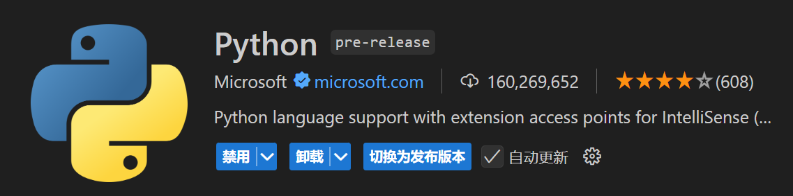
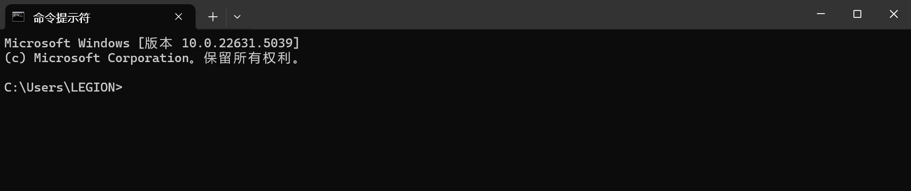
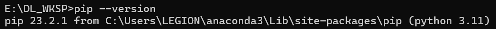
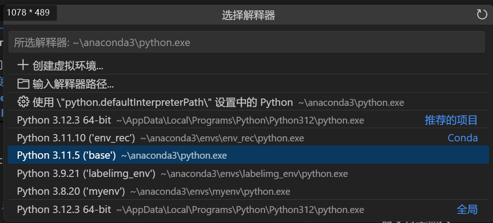

# Windows 系统深度学习环境配置指南
## **方法一 Vscode + Anaconda + pip install**
### 1. **vscode + python插件**
   下载vscode,下载python插件 
### 2. **安装 Anaconda**
   ---
   #### **✅ 用 Anaconda 代替 Python 直接安装的好处**
   1. **自带 Python**：安装 Anaconda 之后，它会自带 Python 解释器，所以**不需要额外下载 Python 官网安装包**。
   2. **集成 pip 和 conda**：可以使用 `pip` 或 `conda` 来安装 Python 包，适合数据科学、机器学习等场景。
   3. **环境管理**：可以使用 `conda create` 创建不同的 Python 版本环境，避免和系统 Python 冲突。
   4. **Jupyter Notebook**：自带 Jupyter Notebook，可以直接写 Python 代码并运行。
   ---
   官网下载Anaconda https://www.anaconda.com/download/success （详细教程见 https://zhuanlan.zhihu.com/p/32925500 ）

   #### 创建虚拟环境

   - 打开 Anaconda Prompt:
   
        在开始菜单中找到 Anaconda Prompt 并打开。

   - 创建新的虚拟环境:
   
        使用以下命令创建一个新的虚拟环境，其中 `YourEnvName` 是你为虚拟环境选择的名称，`python=3.9` 指定了 Python 的版本。
   
        由于Pytorch只支持3.8-3.11的Python版本，请创建虚拟环境时的Python版本号。
   
        ```bash
        conda create -n YourEnvName python=3.9 -y 
        ```
   
   - 进入新创建的虚拟环境：
        ```bash
        conda activate YourEnvName
        ```
   
   - 退出该虚拟环境：
        ```bash
        conda deactivate
        ```
   
   - activate失败（感谢jcgg的贡献qwq）：

        在win11中，很有可能出现activate失败的情况。你可以通过一下两种方式排查。

        1. 首先确定conda已经添加到环境变量。

            对于Windows用户，根据采用的中终端，执行`conda init powershell`或`conda init cmd.exe`命令

            如果出现不能运行的脚本的问题，在管理员模式下打开 PowerShell，并输入以下命令来修改执行策略为 "RemoteSigned"（仅允许运行本地脚本）：`Set-ExecutionPolicy RemoteSigned`

            对于macos和linux用户，可以直接`conda init`

            最后，重新启动shell即可

        2. 如果这种方式失效，可以考虑手动添加虚拟环境到环境变量中

            首先找到你的anaconda的安装地址，打开其中的**envs**文件夹，能找到你创建的环境的文件夹。

            将需要activate的环境文件夹以及其内部的Scripts文件夹添加到环境变量中即可。

            

### 3. 菜单打开Windows CMD 
### 4. 输入 `pip --version` 检查pip版本 

- 如果你的电脑里已经安装好了pip, 建议升级
   ```
   python -m pip install --upgrade pip
---
#### ⚠️ 需要注意的问题
- CMD 默认可能找不到 Python
安装 Anaconda 之后，如果你**在 CMD 运行 `python` 或 `pip` 时报错**，说明 CMD 里没有找到 Anaconda 的 Python，需要手动**添加环境变量**。

- 如何让 CMD 识别 Anaconda Python
  1. **打开 Anaconda Prompt**（安装 Anaconda 之后会有这个程序）。
  2. 输入：
     ```sh
     conda init
     ```
     这个命令会让 CMD 识别 Anaconda 的 Python
  3. 关闭 CMD 重新打开，再试试：
        ```
        python --version
        pip --version
        ```
  4. 如果能正常显示 Python 版本，说明 Anaconda 配置成功！
  


---

### 5. 安装PyTorch (CPU版本)

  - 命令行里输入

    ```
    pip install torch torchvision torchaudio
    ```

### 6. 安装numpy 和 Pillow

- 命令行里输入
  ```
  pip install numpy Pillow
  ```

### 7. Vscode中选择解释器
1. 按 `Ctrl + Shift + P`，输入：
   ```sh
   Python: Select Interpreter
2. 选择 Anaconda 里的 Python 解释器, 通常是：
   ```sh
   C:\Users\你的用户名\anaconda3\python.exe
   ```
   如图 
3. 测试是否成功：在 VS Code 终端输入：
   ```
   python --version
   ```
   如果正确输出 Python 版本，说明 Anaconda 配置完成！

## **方法二 Pycharm+ Anaconda**

### **1. 安装 PyCharm**

PyCharm 是由 JetBrains 开发的一款强大的 Python IDE。PyCharm 使用其自己的虚拟环境管理器，便于环境管理。

1. #### 访问 PyCharm 官网:
   
   访问 [PyCharm 官网](https://www.jetbrains.com/pycharm/download/) ，从“Developer Tools”一栏找到“PyCharm”，点击“Download”。
   
2. #### 选择版本（都可以）:

   **Community**（社区版，免费）
   **Professional**（专业版，收费）
   学生认证教程：https://lic.sjtu.edu.cn/Default/index
   
3. #### 开始安装:
   
   双击安装程序文本，根据向导开始安装，确保安装在自己找得到的目录
   
   
   

### **2. 安装Anaconda见方法一**

### **3. 在Pycharm中使用Anaconda**
1. 点击左上角"File"，点击"Open"，打开一个你的工作目录  
如果是初次使用：点击"Open"，打开一个你的工作目录   


2. 点击"File"，点击"Settings"

      

3. 在"Project"里找到"Python Interpreter",点击"Add interpreter"  
      
4. 选择Conda Environment，点击文件夹图标浏览目录，找到自己Anaconda的安装目录  
      
5. 选择Conda Executable， 点击右边的“Load Environments”
      
6. 选择刚刚创建的虚拟环境"deepLearning"  
  

或者，你也可以通过以下操作添加interpreter：


## **方法三 Google Colab**

如果你选择使用Google Colab，你所需要的只是一个Google账号和一个梯子。

### 1. 使用Google Drive

进入[Google Drive](https://drive.google.com)官网，使用你的Google账号登录，你就获得了一个15GB的云空间。

### 2. 关联 Google Drive 和 Google Colab

首先，点击**我的云端硬盘**，右键点击，点击**更多**，点击**关联更多应用**


搜索**Google Colaboratory**，点击安装


最后，右键点击，点击**更多**，点击**Google Colaboratory**，你就创建了一个.ipynb文件并用Colab打开。其功能与Jupyter Notebook类似，不过支持对云端导入Google Drive文件和使用GPU（有限额）。

### 3. 连接GPU

一般情况下，Colab并不主动提供GPU资源。

你可以通过点击左上角**修改**，点击**笔记本设置**，申请使用GPU加速。


当然，GPU存在使用量上限。因此推荐在没有使用GPU时切换到标准运行时。

你可以通过输入以下命令，了解GPU情况：

``` python
! /opt/bin/nvidia-smi 
```

### 4. 导入Google Drive

由于虚拟机分配有时间限制，免费版最长运行12个小时，在终止运行之后，会造成数据的丢失。因此，我们通常会将文件和数据保存在Google Drive中。

而想要导入Google Drive中的文件，只需要执行以下命令

``` python
from google.colab import drive 
drive.mount('/content/drive/') 
```

登录之后就成功导入Google Drive中的文件。

你可以通过左侧边的**文件**选项查找到Google Drive中的文件。

### 5. 运行

直接输入代码并运行即可。

如果你只是想简单尝试一下，你也可以跳过步骤3和4，直接运行代码块。