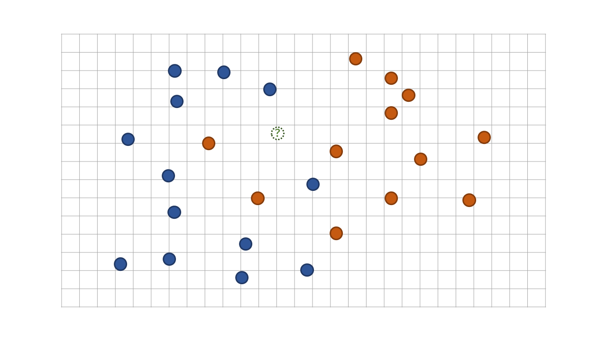
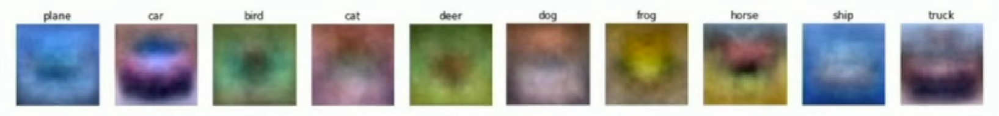
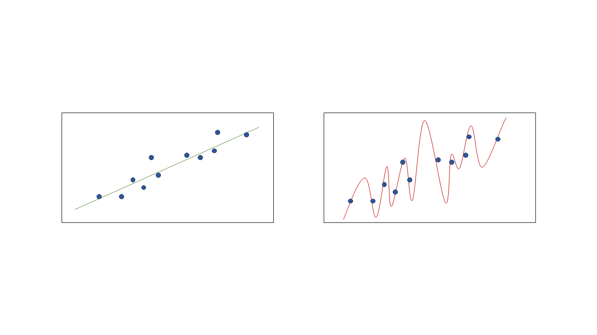
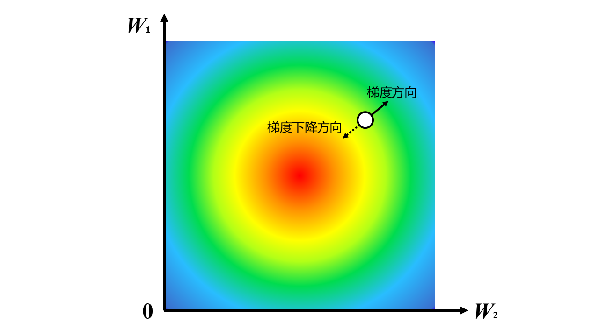
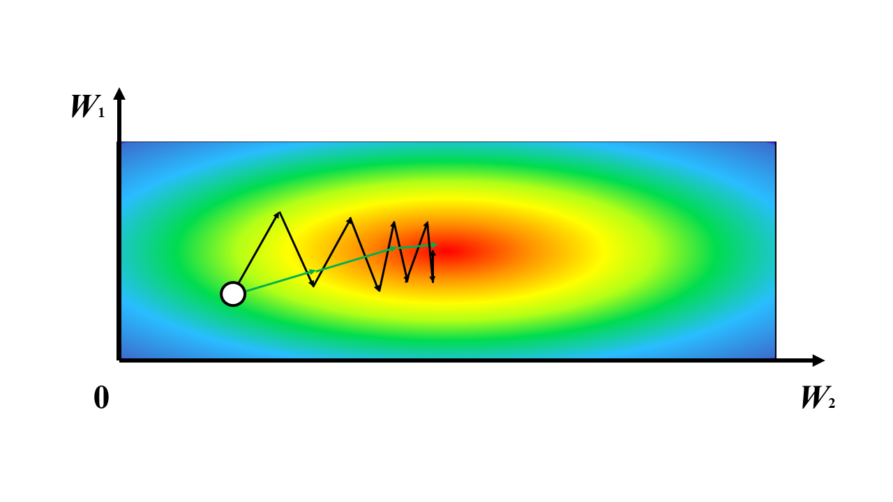

# Deep Learning Workshop 2025 Part A

## 0. 前言 Foreword

计算机很擅长进行大量明确、重复的操作.$\text{\ \ }$国际象棋中一共有 64 个格子，每方共有 6 种走法固定的棋子.$\text{\ \ }$国际象棋的规则也很容易被量化.$\text{\ \ }$因此 IBM 的工程师们将暴力搜索求解与相对固定的人类走法用巧妙的方式结合起来，便能用 40 年前计算机的算力击败世界顶级国际象棋棋手卡斯帕罗夫. 

假设我们有一万张图片，而我们的目标是区分每一张图片是不是猫. 

猫是一种可爱的生物.$\text{\ \ }$我们并不需要有卡斯帕罗夫般的心算能力也能像吃饭、喝水一样判断一张照片是不是可爱的猫猫.$\text{\ \ }$不可否认，看猫图是世界上最好的消磨时间的方式.$\text{\ \ }$但是如果让你判断一万张照片，久而久之，赏心悦目的猫猫在你眼里也会变成平庸的四脚动物.$\text{\ \ }$我们尝试把这个任务交给计算机. 

这个过程中，计算机会遇到诸多问题：

1. 人类可以清晰地从一张图片中看到一只猫，但是计算机只能看到每个像素点的亮度；
2. 同一个摄影师从两个相近的角度拍摄了同一只猫的照片.$\text{\ \ }$在人类眼中，这两张照片可能并没有很大区别，但在计算机眼里，每个像素点的亮度都产生了巨大变化；
3. 同一个摄影师从相同的角度拍摄了两只猫的照片.$\text{\ \ }$在人类眼中，这两张照片很明显都是猫，但在计算机眼里，猫的位置上的像素点的亮度产生了巨大变化……

有时候，照片中只会出现一条猫尾巴，但人类却能笃定地说：这是只猫.$\text{\ \ }$就算我们成功实现了一个能够通过识别猫眼和身体来判断照片里有没有猫的程序，它也不会认为这是一只猫.

## 1. 图像分类问题 Image Classification Problem

以上这个问题是一个分类问题.$\text{\ \ }$假设我们有一堆图片，并且我们人为知道这堆图片可以被分成哪几类，那么我们的目标就是实现一个在接受一张图片后快速判断这个图片属于哪一类.$\text{\ \ }$手写数字识别便属于这一问题. 

### 1.1 数据集 Datasets

深度学习需要大量训练数据.$\text{\ \ }$每个数据点都应形如 `(image, label)`，其中 `image` 为图像本身，而 `label`，即标签，为图像对应的分类.$\text{\ \ }$对于初学者来说，最大的门槛就是获取这一数据.$\text{\ \ }$所幸，已经有很多人为不同情景的模型训练收集了大量被分好类的图片数据，我们可以直接使用它们训练自己的模型.$\text{\ \ }$以下是我们会涉及到的两个数据集：

- MNIST
    - 50000 张训练图片 + 10000 张测试图片；
    - 每张图片都是 28x28 的灰度图像，内容是手写数字；
    - 每张照片对应的标签，表示图像中的数字是 0~9 中的哪一个.
- CIFAR-10
    - 50000 张训练图片 + 10000 张测试图片；
    - 每张图片都是 32x32 的 RGB 三通道图像，内容是生活中常见的十种动物或载具；
    - 每张照片对应的标签，表示图像中的主要物体是哪一类动物或载具.

人类能快速判断一张照片属于哪一类，是因为人学习过什么是猫.$\text{\ \ }$我们尝试在计算机上复现这个学习过程. 

### 1.2 k-Nearest Neighbor 算法

我们以 CIFAR-10 为例，考虑如何实现一个靠谱的图像分类算法. 

#### 1.2.1 问题简化

我们先考虑一个更简单的问题.$\text{\ \ }$有一个被红蓝两种颜色涂满的二维平面，但是我们并不知道红色和蓝色的边界在哪.$\text{\ \ }$但是我们知道这个平面上有很多点，我们也知道每个点所在的位置上平面被涂的颜色是什么.$\text{\ \ }$我们希望能尽可能准确地猜测平面上任意一个点（在图中用绿色虚线轮廓的点表示）所对应的颜色是什么. 

一个很直观的想法是根据距离这个点最近的 $k$ 个邻居的颜色来决定这个点对应的颜色.$\text{\ \ }$当 $k=5$ 时，我们发现距离未知点最近的 $5$ 个点中，有 $3$ 个红点和 $2$ 个蓝点.$\text{\ \ }$那么我们便预测这个点是红色的.$\text{\ \ }$这便是 k-Nearest Neighbor (kNN) 算法.

#### 1.2.2 kNN

回到 CIFAR-10 数据集.$\text{\ \ }$ CIFAR-10 的每个图片都由 32x32 个 RGB 三通道的像素组成，并且有 10 种可能的标签.$\text{\ \ }$把图片上每个像素点上每个通道的明度都当作这个图片所对应数据点在某一维上的坐标，我们便可以把每个图片映射到一个高维空间的点上.$\text{\ \ }$于是我们改编一下上述问题：

有一个被 $10$ 种颜色涂满的，$32\times32\times3=3072$ 维的高维空间，但是我们并不知道这 $10$ 种颜色的边界在哪.$\text{\ \ }$但是我们知道这个空间上有 $50000$ 个点，我们也知道每个点所在的位置上的空间被涂的颜色是什么.$\text{\ \ }$我们希望能尽可能准确地猜测这个高维空间中的任意一个点所对应的颜色是什么. 

在使用 kNN 算法之前，我们需要先解决两个问题：

我们需要先定义 $3072$ 维的空间中两个点的距离.$\text{\ \ }$假如$I_i$ 代表第 $i$ 张图片的数据点，$I_{i,p}$ 代表这个数据点在第 $p$ 维上的距离，拓展二维空间中欧氏距离的定义，可以得到
$$d(I_1, I_2) = \sqrt{\sum_{p=1}^{3072}(I_{1, p}-I_{2,p})^2}.$$

其次，考虑到取 $k$ 个最近的邻居的众数可能会出现平局的情况，我们需要一个能够打破平局的规则.$\text{\ \ }$当平局出现时，可以从最高票数的几个标签中选择一个距离最近的点.

#### 1.2.3 超参数 Hyperparameters

超参数指在模型训练之前就已经人为确认好的参数.$\text{\ \ }$在 kNN 算法中，这个 $k$ 便是一个超参数.$\text{\ \ }$我们考虑怎样才能选择最优的 $k$.

1. 采用在训练数据上表现最好的 $k$
    - 这种做法等价于直接选择 $k=1$. 
2. 将已有数据分成两部分：90% 用于训练，剩下的 10% 用于测试；选择在测试数据上表现最好的 $k$
    - 我们无法确认这样选择的 $k$ 在新数据上的表现如何.

我们在调试超参数时需要注意数据污染问题: 我们不能让测试数据对超参数的设置产生影响.

3. 将已有数据分成三部分：大部分用于训练，一小部分用于验证，另一小部分用于测试；选择在验证集上表现最好的 $k$，再在测试集上测试算法的准确率.

#### 1.2.4 反思

这个方法很蠢.

kNN 模型无需训练，但设 $N$ 为训练数据集的大小，$d$ 为每个数据点的维数，使用 kNN 预测一个测试图片的标签的时间复杂度是 $O(dN)$ 的么在 $N=50000, d=3072$ 时，测试一张照片很慢.$\text{\ \ }$实际上，我们可以忍受训练模型时的高时间复杂度，但要求使用这个模型来预测未知数据的标签尽可能高效.

其次，对每个像素的每个通道求欧式距离这个操作并没有什么直观意义.

值得一提的是，对卷积神经网络 (ConvNet) 处理后的多维空间中的数据点使用 kNN 算法效果很好.$\text{\ \ }$这一算法会在 Part 2 中提及.

## 2. 线性分类器 Linear Classifier

我们也可以把每个图片拉成一个 $32\times32\times3=3072$ 维的向量，并想到可以使用矩阵乘法来对这个向量进行线性变换.
令 $f(x;W)=W\cdot x+b$.$\text{\ \ }$其中，$x$ 是 $3072$ 维的图片向量，$W$ 是 $10\times3072$ 的参数矩阵，$b$ 是一个 $10$ 维向量，代表偏差.$\text{\ \ }$ $W\cdot x+b$ 的结果是一个 $10$ 维的向量，其中第 $i$ 维的大小代表 $W$ 对 $x$ 属于第 $i$ 个标签的评分.$\text{\ \ }$我们想让正确标签的评分最高.

学过线性代数的同学们知道，我们可以把 $W\cdot x+b$ 简化为一次矩阵乘法：

$$
Wx + b =
\left[ {\begin{array}{cc} W&b \\ \end{array}}\right]
\left[ {\begin{array}{cc} x \\ 1 \\ \end{array}}\right].
$$

因此我们在接下来的讨论中把 $b$ 也当成 $W$ 的一部分，省去单独考虑的麻烦.

思考一下这里 $W$ 的意义.$\text{\ \ }$ $W$ 的第 $i$ 行向量似乎对应着第 $i$ 个标签，使得对应标签的图片在与它进行乘积以后能获得最大值.$\text{\ \ }$同时，$W$ 每一行的大小都与图片向量相同，我们可以把 $W$ 的每一行想象成一个模板图片.

但是这样做也有一个问题：一个标签只能对应一个模板. CIFAR-10 的数据集里面有很多标签为 `horst` 的图片，而这些图片里马的朝向有左有右，最后训练出来的 $W$ 中马的模板如图中所示，是一匹模糊的双头马. 感性理解，线性分类器并没有真正学习到马的特征是什么，而是通过大的像素团块的位置比对来进行分类.

### 2.1 损失函数 Loss Function

在考虑怎么获得优秀的参数矩阵 $W$ 之前，我们可以先考虑怎样评定一个 $W$ 是否优秀. 

假设我们的数据集一共有 $N$ 个数据，形如 $\{(x_i, y_i)\}_{i=1}^N$. 定义每个数据对于 $W$ 的损失函数 $L_i(f(x_i; W), y_i)$，而整个数据集对于 $W$ 的损失函数

$$L=\frac{1}{N}\sum_{i=1}^NL_i(f(x_i; W), y_i).$$

对于某个图片向量 $x_i$，令 $s_i=f(x_i,W)$ 为其评分向量.$\text{\ \ }$我们取评分最高的那一个标签作为对这个图片的预测.$\text{\ \ }$既然评分越高代表这个图片属于这个标签的可能性越大，那么我们不妨把 $s_i$ 处理成一组条件概率 $p_i$.$\text{\ \ }$令标签数为 $M$，我们需要 $p_i$ 满足两个性质：
1. $p_i$ 每个维度上的分量之和需要为 $1$，即
$$\sum_{j=1}^Mp_{i,j}=1;$$
2. $p_i$ 中正确标签对应的概率需要远大于其他错误标签的概率.

很快我们便能想到一种方案：直接把 $p_i$ 中 $s_i$ 最大的那一维设成 $1$，其余维设成 $0$. 然而这样做以后，我们发现对于同样一张图片 $x$， $p_i$ 在以 $W$ 为自变量时并不可导. 可导性对于我们寻找最准确的 $W$ 至关重要，所以我们要稍微改变一下策略：

#### 2.1.1 Softmax 函数 & 交叉熵损失函数 Cross-Entropy Loss

$$p_{i,j}=\frac{\exp s_{i,j}}{\sum_{k=1}^{M}\exp s_{i,k}}.$$

这样做相当于是用可导的函数对直接取最大值设为 $1$ 的操作进行模仿，因此我们称其为 Softmax 函数.

我们再考虑怎么用 $p_i$ 计算 $L_i$. 一个 $W$ 最好的情况下可以完美拟合数据集中的所有数据，设这个时候的 $L_i=0$. 随着 $W$ 的拟合能力越差，$L_i$ 也应该变得越大.

$$L_i(f(x_i, W), y_i)=-\log p_{i, y_i}.$$

这便是符合以上特征的交叉熵损失函数. 我们暂且不考虑它为什么叫这个名字，以及取对数再取反的操作有什么意义.

#### 2.1.2 正则化 Regularization

在设计损失函数的时候，我们还需要考虑如何避免过拟合的发生.

先考虑一个相对简化的情况：如图所示，给定二维平面坐标系上的很多点，要求拟合出一条能够相对准确地概括这些点的规律的多项式曲线.

经验告诉我们，直接用如左图所示的线性方程便能概括这些数据的大体走向. 然而如果一定要让计算机为我们选择一条完全拟合所有数据点的曲线的话，可能会得到这样一条超级繁琐的多项式曲线. 然而计算机并不知道这一点，因此我们需要再次引入一个超参数，来向计算机表达我们讨厌过拟合的需求.

回顾一下，超参数是指在模型训练之前就已经人为确认好的参数，比如 k-NN 算法里的 $k$ 就是一个超参数. 在这里，我们想向损失函数中加入一个超参数项，来增大发生过拟合的曲线的损失函数的数值.

在上图的示例中，多项式中非 $0$ 的项越多，这个多项式曲线就越复杂. 相似地，我们经验主义地把对这种对非 $0$ 项的反感通过超参数告诉计算机. 可以在现有的损失函数后加一项正则化项：

$$L=\frac{1}{N}\sum_{i=1}^NL_i+\lambda\cdot R(W),$$

$$R(W)=\sum_j\sum_k(W_{j,k})^2.$$

其中，$\lambda$ 是一个实数，用来调整正则化项对损失函数的影响大小. $\lambda$ 的大小和 $R(W)$ 的定义方式都可以算作是超参数，在确定它们时我们同样需要避免数据污染.

这样把 $W$ 的每一项拿出来平方后求和的标准化方式叫做 L2 标准化，而事实证明，这么做的效果很好. 至于这么做为什么能得到很好的结果，感兴趣的听众可以进一步查阅相关文献进行探索.

### 2.2 对 $W$ 进行优化

现在我们知道要用一个矩阵对原始图像进行线性变换，也知道可以通过损失函数来评判一个矩阵是否能够忠实地反映数据集中的规律，接下来我们的目标是求得一个损失函数 $L$ 很小的 $W$. 我们终于要开始训练我们的模型了.

直接讨论矩阵有些复杂，我们不妨再次简化问题. 对于一个可导函数 $f:\mathbb{R}\rightarrow\mathbb{R}$，对其在某点求导可以得到这个函数的图像在某点的斜率：

$$\frac{d f(x)}{dx}=\lim_{h\rightarrow 0}\frac{f(x+h)-f(x)}{h}$$

假设我们想求这个函数上比较小的一点，我们可以从任意一点开始，顺着斜率的方向下降. 虽然这样做不能使我们稳定地落在全局最小值点，但至少可以确保一个局部最优解.

#### 2.2.1 梯度 Gradient

多元函数也有类似的梯度向量，其中向量的每一维代表多元函数关于每一个变量的导数. 多元函数在某个方向上的斜率可以通过这个方向向量和梯度向量求点积来得到，而通过数学运算，我们可以知道多元函数下降最快的方向其实就是这个梯度向量取反后所指向的方向. 

#### 2.2.2 梯度下降 Gradient Descent

我们知道损失函数 $L=\frac{1}{N}\sum_{i=1}^NL_i(f(x_i; W), y_i)+\lambda\cdot R(W)$ 是一个关于 $W$ 的函数，也是关于 $W$ 每一项的一个多元函数. 于是我们便可以求出 $L$ 关于 $W$ 的梯度 $\nabla_WL$，随即我们便可以知道在 $W=W_0$ 时，怎样变化 $W$ 才能使损失函数 $L$ 下降得最快. 

考虑怎样求得 $\nabla_WL$.

1. 我们可以通过稍微给 $W$ 中的每一项增加一个极小值后查看 $L$ 的变化量的方式来得出 $\nabla L_W$ 的数值解，但是当 $W$ 的矩阵大小很大的时候，这样做的效率很低.
2. 我们也可以手动推导 $L$ 关于 $W$ 中每一项的偏导，但我们每次想要修改我们的算法时都需要重新推式子，这很麻烦.
3. 我们可以设计一种模块化的，能够通过算式自动得到梯度解析解的算法. 这就是耳熟能详的 **反向传递 (Back Propagation)** 算法，感兴趣的听众可以自行查阅资料.

我们通过多次迭代的方式从一个随机的起点 $W_0$ 下降到一个局部最优的 $W$.

$$
\begin{aligned}
&\text{\textbf{procedure} GradientDescent}(rate, cnt)\\
&\text{\quad\quad\textbf{initialize }}W\\
&\text{\quad\quad\textbf{for} }t=1\textbf{ to } cnt:\\
&\text{\quad\quad\quad\quad}d:=\nabla_W L(W)\\
&\text{\quad\quad\quad\quad}W:=W-d\cdot rate\\
&\text{\quad\quad\textbf{end}}\\
&\text{\textbf{return }}W
\end{aligned}
$$

在这个过程中，$W$ 的初始化方式、$rate$ 学习速率（步长）以及 $cnt$ 步数都属于需要预先设定好的超参数.

#### 2.2.3 随机梯度下降 Stochastic Gradient Descent

回顾损失函数 $L$ 的计算过程：我们需要枚举数据集中每一个数据点的损失函数 $L_i$ 并将其求和. 而每一个 $L_i$ 都需要执行一次矩阵乘法. 当矩阵长宽很大，或者之后我们设计更复杂的模型，用到更多次矩阵乘法的时候，每执行一步下降的时间代价很高，这是我们无法接受的.

我们考虑每次计算梯度的时候，都只从庞大的数据集中随机抽取一小份计算 $W$ 在这一小份数据上的损失函数 $L'$ 以趋近 $L$，用更少的计算次数获得近似解，这就是随机梯度下降 (Stochastic Gradient Descent，简称 SGD).

然而由于我们并不知道 $L$ 关于 $W$ 有没有什么特别好的性质，这可能导致我们在进行随机梯度下降时遇到一些让算法效率变低的问题. 

如图所示，当梯度在 $W$ 的两个分量上下降速度不一致时，我们可能希望 $W$ 沿绿色的折线快速下降到局部最优点，但实际上 $W$ 会严格按照负梯度的方向，沿黑色折线缓慢下降，这会严重降低我们训练模型的速度.

#### 2.2.4 SGD + 动量方法

考虑怎么避免这种折线状的梯度下降路线出现. 2.2.3 的示意图中，一个效率很高的梯度下降路线被夹在了黑色的行进路线之间. 有没有一种方法能让下降路线大体维持在梯度附近，但不会被折线状的梯度变化降低效率呢？

在粗糙的平面上有一个小物块，它每秒会获得一个方向不同的加速度，但它的运动轨迹还能维持成平滑的曲线. 新的加速度只会稍微改变物体的动量，并不会直接带着物块沿着加速度的方向直接运动. 运用这个类比，我们改进一下我们的随机梯度下降：

$$
\begin{aligned}
&\text{\textbf{procedure} GradientDescent}(rate, cnt, \mu)\\
&\text{\quad\quad\textbf{initialize }}W\\
&\text{\quad\quad}v:=0\\
&\text{\quad\quad\textbf{for} }t=1\textbf{ to } cnt:\\
&\text{\quad\quad\quad\quad}d:=\nabla_W L(W)\\
&\text{\quad\quad\quad\quad}v:=\mu\cdot v+d\\
&\text{\quad\quad\quad\quad}W:=W-v\cdot rate\\
&\text{\quad\quad\textbf{end}}\\
&\text{\textbf{return }}W
\end{aligned}
$$

在动量方法中，我们新引入了一个超参数 $\mu$，它的作用与平面上的摩擦因数差不多. 当然，这个方法绝非完美. 感兴趣的听众可以自行研究 RMSProp, Adam, Second-Order Optimization 等更优的算法.

## 3. 神经网络 Neural Networks

既然我们发现用矩阵乘法能够拟合给定的数据集，不妨多加几层试试？令 $f(x;W_1, W_2)=W_2\cdot W_1\cdot x$.$\text{\ \ }$ 此时，我们在梯度优化的时候要同时优化 $W_1$ 和 $W_2$.

但这么做实际上有一个很大的问题：$W_1, W_2$ 都是矩阵，而矩阵乘法具有结合律. 如果我们令 $W=W_1\cdot W_2$，那么这个模型的拟合能力其实没有发生任何变化，我们在优化的时候还耗费了更多的资源.

### 3.1 激活函数 Activation Function

都是线性的锅！我们要引入非线性因素，破坏掉矩阵乘法的结合律，增强我们模型的拟合能力！

令 $f(x;W_1, W_2)=W_2\cdot \max(0, W_1\cdot x)$. 这里的 $\max(0, \cdot)$ 操作代表把矩阵里的每一项与 $0$ 取最大值. 类似地，我们还可以引入更多层矩阵：$f(x;W_1, W_2, W_3)=W_3\cdot\max(0, W_2\cdot \max(0, W_1\cdot x))$. 

由于 $W_2$ 的长宽并没有被输入和输出向量的维度框死，我们可以将其放大. 这样，我们就相当于把之前所说 $W$ 每行作为一个模板的限制扩大了：现在一个标签可以对应很多个模板，我们的模型也就有了“学习”一种标签的图片中的多个特征的能力.

像 $\max(0,\cdot)$ 这样能够给模型引入非线性因素的函数被称为激活函数. $\max(0, \cdot)$ 由于计算速度快，不会在嵌套多层后引发**梯度消失**等优点而被经常使用，赐名 ReLU (Rectified Linear Unit，线性整流函数).

但是由于 ReLU 中存在一个不可导的零点，有时会使用其他函数来替代 ReLU，如 ELU 函数:

$$ELU(x)=\left\{\begin{align*}
&x &x\geq0\\
&\alpha(e^x-1) &x<0\\
\end{align*}\right.$$

另外，由于 ReLU 会抹消掉矩阵中所有小于 $0$ 的项，这可能会导致信息的过快损失. 有时我们也会使用 Leaky ReLU 作为激活函数：

$$Leaky\ ReLU(x)=\max(0.1x, x)$$

### 3.2 感知器 Perceptron

我们不只可以反复地对一个矩阵进行这样的操作：我们还可以把输入的向量用多种途径进行线性变换+非线性激活函数的处理后线性组合在一起.

到此为止，我们从零开始构建出了深度学习的基本单元 —— 感知器 (Perceptron).

有没有发现它长得很像一个神经元？

## 参考资料 References

Bertolotti, Jacopo. 梯度下降动画. https://twitter.com/j_bertolotti/status/1121054414066810881

Johnson, Justin. UMich EECS-498.

MIT 6.S191. 感知器的构造.