# CNN基础介绍（卷积神经网络）
1. CNN是什么？有什么用？
2. CNN的核心结构
3. CNN实现-结合代码解释之MNIST识别

## 一、什么是CNN？
CNN（Convolutional Neural Network，卷积神经网络）是一种专门用于处理图像和视频数据的深度学习模型。它能够自动提取图像中的特征，比如边缘、颜色、形状，进而进行分类、检测或分割等任务。
以下是CNN、机器学习、深度学习、图像识别和大模型的文氏图：

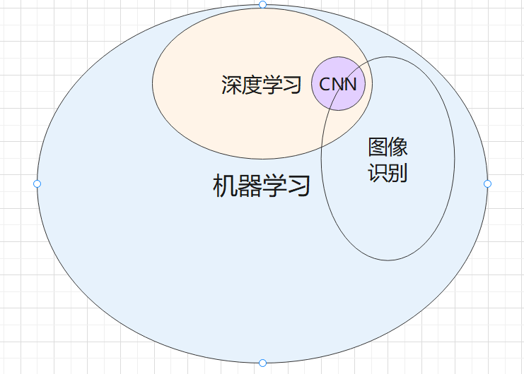

可以把 CNN 想象成一个智能识图系统，类似人类大脑处理视觉信息的方式。比如，你看到一只猫，并不会从一堆像素点中逐个分析，而是通过边缘、纹理、形状等特征快速识别出来。
想象一只猫的照片被打印在一张超级无敌大的纸上，你要看这张纸，得一点点在纸上爬，所以你每次只能看到一个或几个像素点，而不能看到整只猫。

现在，你是一台计算机了！你要从一个一个像素开始，分辨出这是一只猫。

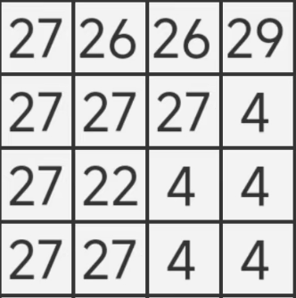

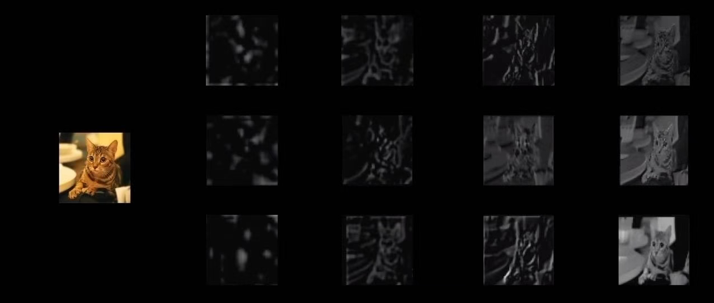

这是真猫。

## 二、CNN的核心结构
1. 卷积层
2. 池化层
3. 全连接层
4. 激活函数

---
### 1. 卷积层
---
1. 作用：提取特征，比如边缘、纹理等。
2. 类比：像放大镜一样，滑动着查看图像的不同部分，提取关键特征。
3. 实现过程：
    - 取一个小窗口（称为卷积核，有时也被称为滤波器），是一个小矩阵，通常是3*3或者5*5，这个小矩阵在输入数据上滑动，每次识别9个或者25个像素点。每个卷积核会学习不同特征，比如你学猫的耳朵，你学猫的眼睛。
    - 每个位置的计算方式是：输入区域的像素值 × 卷积核的权重，然后求和（加上偏置 b）。
    - 使用padding填充。

#### 1.1 这些像素点的信息是什么样的呢？

  1. 灰度图

    0 = 黑色（完全无光）
    255 = 白色（最亮）
    中间值（如 128） = 灰色  

    在计算机内部，每个像素点存储为一个 8-bit 整数（0~255或浮点数（0~1））。

  2. RGB 彩色图像

    在RGB（红绿蓝）模式下，每个像素由3 个数值组成，分别代表：
    R（红）
    G（绿）
    B（蓝）
    每个通道的数值范围通常是：
    0 = 该颜色通道没有光（如 R=0 代表无红色）
    255 = 该颜色通道最亮（如 B=255 代表最蓝）
    (R, G, B) = (255, 0, 0) 代表纯红色
    (R, G, B) = (0, 255, 0) 代表纯绿色
    (R, G, B) = (0, 0, 255) 代表纯蓝色    
    (R, G, B) = (255, 255, 255) 代表白色
    (R, G, B) = (0, 0, 0) 代表黑色

所以，当小矩阵读取这块区域的像素的时候，其实是读了一串数字。而卷积核自己的原始数字是随机的(这个数字叫做权重)，于是它拿自己和读到的像素相乘，再把结果相加，得到一个新数值，这就是卷积计算的过程。这个新的数值会替代原图中的对应像素点，作为卷积操作的输出。卷积核会在整个图像上滑动并执行这些操作，直到整个图像的卷积结果都计算完成。

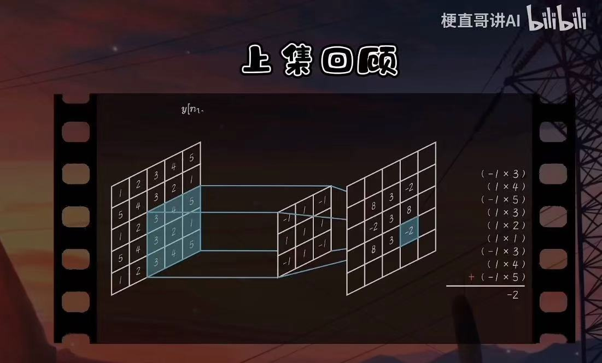

#### 1.2 卷积核在图像上是怎么移动的？
我们在程序中通过“步长”控制，我们可以输入1、2、3来决定卷积核移动的幅度，几就是几个像素。

#### 1.3 为什么卷积核一开始的数字是随机的？
1. 避免对称性问题，确保不同神经元学习不同的特征
    - 如果所有卷积核的初始值都相同，那么它们在训练过程中会更新出相同的权重，模型最终可能只学会提取单一类型的特征（比如只会检测水平边缘）。
    - 随机初始化可以保证不同的卷积核有不同的起点，学习不同的图像特征（如边缘、角点、纹理）。
    - 就像让几个人去画一只猫，如果大家的起始草稿完全一样，他们后续修改的方向也可能趋于一致。但如果起始草稿不同，每个人最终的画作就可能更丰富多样。

  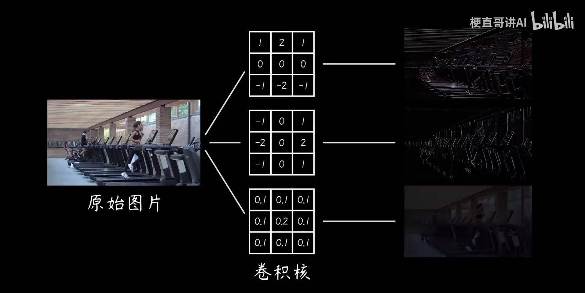

2. 让梯度下降算法能够顺利优化
    - 梯度就是一个函数的偏导数，表示函数在某一点的变化率和方向。训练函数的时候，会有一个损失函数，用来反馈识别出来的图像和实际的差错有多少，调整权重时，按损失函数最快变小的方向，也就是梯度下降最快的方向调整。
    - 神经网络训练时，通过梯度下降来不断调整权重。如果所有卷积核的初始值都一样，梯度更新的方向也会一样，导致所有卷积核学到相同的特征，网络表达能力下降。
    - 随机初始化权重让梯度更新更具多样性，模型可以学习更丰富的信息。
    - 像是在山坡上找最优路径（全局最优解）。如果所有人都从同一个点出发，可能会陷入同一个局部低谷（局部最优解）。但如果从不同位置开始，就更可能找到真正的最优解。

    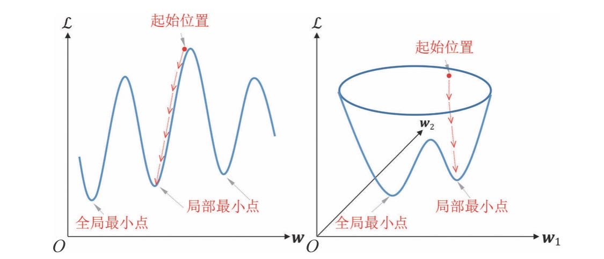

3. 避免神经元死亡
    - 神经元由输入-权重-加权求和-激活函数-输出组成
    - 如果初始值设置得太极端，比如所有权重都是0，会导致某些神经元在训练过程中始终输出相同的值，最终变得“无用”。
    - 通过适当的随机初始化，可以避免这个问题，使所有神经元都有机会参与学习。

#### 1.4 怎么靠卷积算出“特征”？
- 刚才说过，卷积核在图片上滑动时，会把矩阵与像素信息相乘再求和，得到一个新的数字代替原来的像素信息。
- 那么计算机怎么知 道这一串数字是边缘，那一串数字是眼睛鼻子呢？
- 比如说一个检测到 竖直边缘的卷积核，它输出的数字可能是这样的：

    [ 1  0  -1 ]

    [ 1  0  -1 ]

    [ 1  0  -1 ]

    看到左边亮、右边暗时，结果是正数 → 说明是右侧边缘。
    看到左边暗、右边亮时，结果是负数 → 说明是左侧边缘。
    如果两边颜色一样，结果是 0 → 说明没有边缘。

    这就是第一层卷积学到的，第二、第三层卷积会逐步学习到更“高级”的知识。

#### 1.5 卷积怎么知道哪些信息重要？
- 刚才说过，卷积核一开始的数字是随机的，也就是权重随机。每一轮训练完后，会有一个损失函数，对比预测结果和真实结果。如果CNN发现自己错了，就会根据梯度下降最快的方向调整权重，进行下一轮学习。

#### 1.6 为什么要用padding？
- padding在输入图片四周补上额外的像素（通常是 0），这样可以让卷积计算后的特征图尺寸不变或减少得更慢。
- 防止卷积核越卷越小。

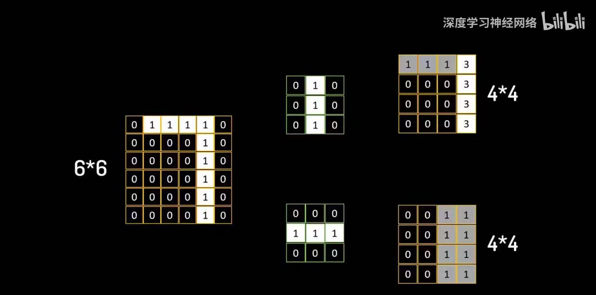

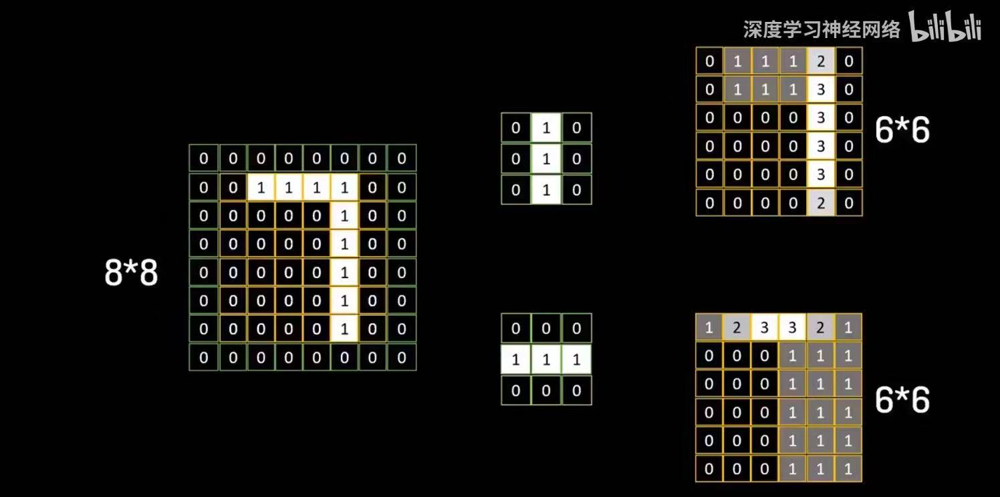

#### 1.7 偏置是什么？
  神经元的计算公式：

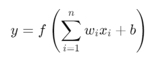

  简单来说是一个线性函数。
  - 如果没有偏置的话，训练的结果必须经过原点。如果没有偏置，输入全是 0 的时候，输出就一定是 0，不够灵活。

#### 1.8 卷积有好多层
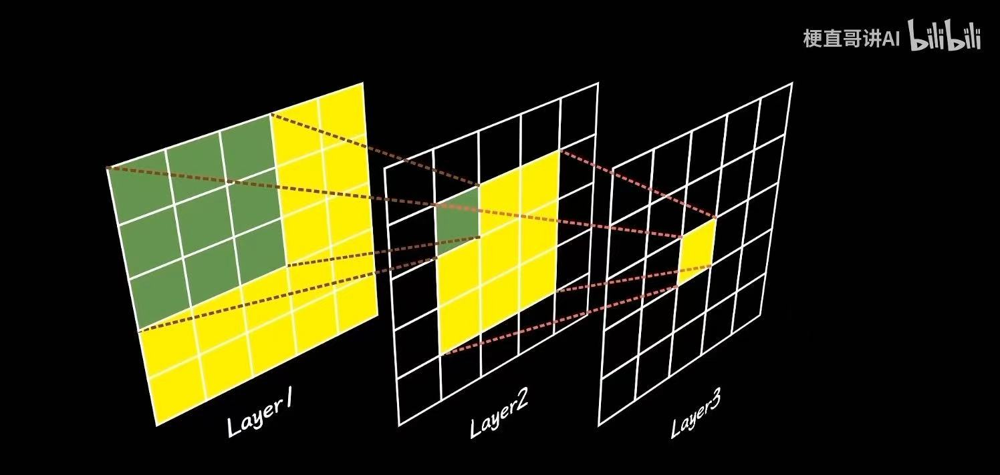

---
### 2. 池化层
---
减少特征图的尺寸，从而减少计算量，防止过拟合，并使得模型对平移、旋转等变换具有一定的不变性。
（鲁棒性）

#### 2.1 池化层是怎么减少特征图尺寸的呢？
1. 最大池化
- 输出池化窗口的最大值

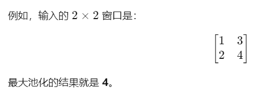

2. 平均池化
- 输出池化窗口的平均值

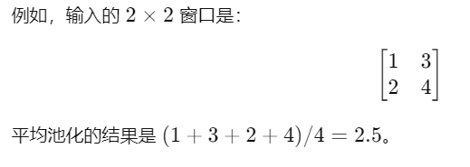

#### 2.2 池化层的工作原理是怎么样的？
池化层会在输入的特征图上滑动一个窗口，类似于第一层卷积。也有步长、填充等。

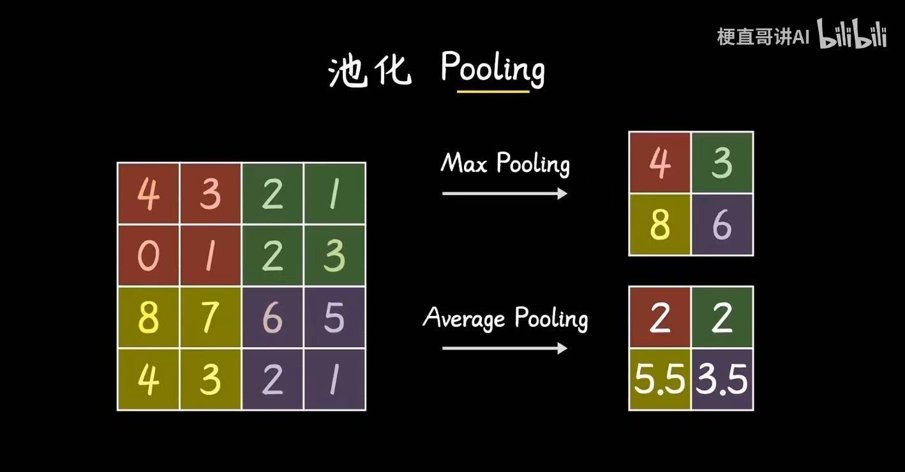

---
### 3. 全连接层
---
是CNN中的最后几层，将前面卷积层和池化层提取的特征转化为最终的分类结果或回归值，并最终输出网络的预测结果。
每个神经元都与前一层的每个神经元连接，每个输入都会影响每个输出。将输入数据通过加权和进行转换，然后通过激活函数得到输出。
1. 整合特征：卷积层输出的是多个特征图，全连接层将这些特征展平（flatten）并结合起来，用于最终的分类或回归任务。
2. 最终结果：它通过学习权重，决定输入属于哪个类别。例如，在一个 10 类分类任务中，全连接层可能有 10 个输出节点，每个节点对应一个类别的概率。也就是说，最终预测结果不是一个答案，而是一个10维的向量，对应十个概率，最终结果是概率最大的那个分类。
3. 加权求和+偏置+激活函数

#### 3.1 什么是展平？
- 将多维的数据转换为一维向量。
- 在 CNN 里，卷积层和池化层输出的是多维的特征图，但全连接层需要的是一维向量，因此需要展平操作。例如：
  卷积层可能输出 (batch_size, 7, 7, 64) 形状的张量（即 64 个 7×7 的特征图）。
  展平后，它会变成 (batch_size, 7 × 7 × 64) = (batch_size, 3136) 的一维向量。
  这样，全连接层就能接受它作为输入，并进行分类或回归任务。
- batch_size 是神经网络在一次训练（前向传播 + 反向传播 + 参数更新）中处理的样本数量。计算机一次性处理整个数据集可能太慢，或者占用太多显存，所以我们 把数据集拆成多个小批次（Batch），每次喂一部分数据，既能减少计算负担，又能提高计算效率。

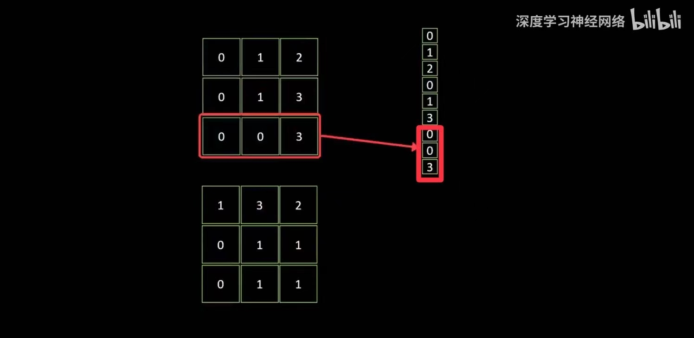

#### 3.2 什么是反向传播？
- 用来计算梯度（也就是偏导数，一个函数对其输入变量的变化率），让参数沿着降低损失（梯度下降）的方向更新。

---
### 4. 激活函数
---
将神经元的输入信号转化为输出信号，并控制信息如何流动。
1. CNN通过一层一层的卷积逐步学习到高级特征。
2. 引入非线性：如果没有激活函数，无论网络有多少层，整个网络都会退化成一个单层线性模型。即使有多个层，网络的输出仍然只能表示输入的线性组合，这限制了模型的表现能力。激活函数能够引入非线性，使得网络能够学习和拟合更复杂的函数。
3. 决策功能：激活函数决定了神经元是否“激活”并通过神经网络传递信号。这对于在多层网络中层层传递信息非常重要。

#### 4.1 激活函数是什么？
- 是公式，有很多种，比如Sigmoid，Tanh，ReLU等。但是不需要弄懂它的数学原理，只要会导入库并使用就行了。
- 通常都是非线性函数

#### 4.2 为什么要用非线性函数？
现实世界的数据并不是线性分布的，比如：
- 手写数字识别：同一个数字可能被不同人以不同笔迹写出来，线性模型很难找到一个简单的分割边界，而非线性CNN可以学习到复杂的特征，比如笔画的方向、闭合区域等。
- 人脸识别：同一个人可能在不同角度、光照、表情下看起来不一样，CNN 需要灵活地适应这些变化。
- 在 CNN 里，每一层的输出都是前面层的组合。如果所有层都是线性的，最终结果仍然是一个线性组合，不会比单层网络强多少。但是加入非线性激活函数后，每一层的特征都会经过非线性变换，从而学习到更丰富的特征。
- 一些玄乎的：根据通用逼近定理（Universal Approximation Theorem），一个具有至少一层隐藏层和非线性激活函数的神经网络，可以逼近任何复杂的函数。因此，CNN 通过多个非线性层，可以更灵活地学习高维特征，并找到数据之间的深层关系。
- 总结：更灵活

---

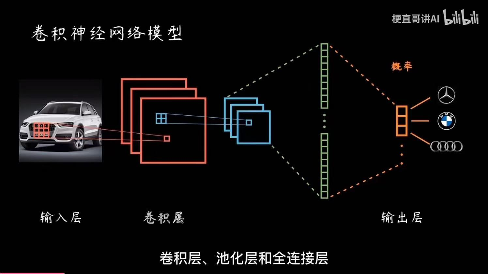

## 三、好了，不折磨大家了，我们来看看MNIST代码实现

MNIST是经典图像识别的示例，一个手写数字数据集，包含70,000张灰度图像（28×28像素）。其中60000张用于训练，10000张用于测试。

1. 引入库
2. 定义CNN
3. 向前传播
4. 预处理数据
5. 加载MNIST数据
6. 训练CNN
7. 循环训练
8. 测试模型

---
### 1. 引入库
---
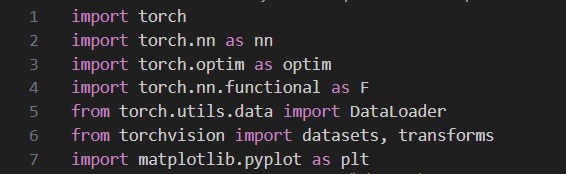

- torch：PyTorch 的核心库
  1. 创建张量（可以理解为矩阵）
  2. 初始化张量（初始化卷积核一开始的权重）
  3. 可在GPU上跑（更快，但我没有GPU）
- torch.nn：用来构建神经网络
  1. 神经网络
  2. 激活函数
  3. 损失函数
- torch.optim：优化器
  1. 计算梯度
  2. 更新参数
  3. 清空梯度
- torch.nn.functional：是函数，直接调用
- torchvision.datasets：用来加载 MNIST 数据集
- transforms：用来对图片进行预处理，转换成 PyTorch 认识的格式
- DataLoader：用于批量加载数据，提高训练效率
- matplotlib.pyplot:用来画图，但这个代码里其实没用到

---
### 2. 定义CNN
---
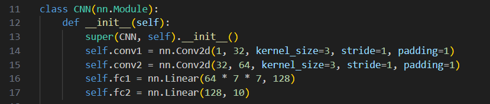

- `class CNN(nn.Module):`

  1. 这整个class把nn.Module里的东西扒拉下来用。 
  2. 一个神经网络通常是由多个层（如卷积层、全连接层等）组成的。这些层的管理、参数的存储、计算的执行，都由 nn.Module 负责。
  3. 比如，nn.Linear，nn.Conv2d都是nn.Module里定义好的类。所以，只有继承了nn.Module，才能正确使用它们。
- `def __init__(self):`

  1. def是python中定义函数的语法
  2. `__init__`是构造函数的意思，不能随便改，换一个名字它就不会当你在写一个构造函数了
  3. self是一个指向当前对象的引用，表示该方法是属于当前实例的。可以通过 self 来访问类中的变量和方法。也可以改成别的名字。
- `super(CNN, self).__init__()`
  
  是用来调用父类构造方法的语法。

  1. super() 是用来调用父类的方法，通常用于在子类中调用父类的构造函数或者其他方法。它可以确保在继承的层次结构中调用父类的相应方法。
  2. CNN: 是当前类的名称。在 super() 中，指定了当前类名 CNN，目的是明确从哪个类去查找父类的方法。在多重继承的情况下，super() 会根据类继承的顺序查找父类。
  3. self: 是当前类实例的引用，它指向当前对象。在调用父类方法时，self 表示的是当前对象，用来确保父类方法作用于当前实例。
  4. init: 是父类的构造方法，通常用于初始化父类的属性。
  - 父类是一个已有的类，它定义了一些通用的属性和方法，子类可以继承这些属性和方法。
  - 子类是从父类继承的类，它可以继承父类的属性和方法，并且可以扩展或修改父类的功能。子类可以在父类的基础上添加新的功能或重写父类的方法。
      - 比如父类是class Animal :
      - 子类是class Dog (Animal) :
  - 比如说，`super(CNN, self).__init__(input_size)` 会调用 Model 类的 `__init__` 方法，确保 Model 类的 input_size 属性被正确初始化。
  - 所以，`super(CNN, self).__init__()`可以确保Model类里的所有属性都被正确初始化。

- `self.conv1 = nn.Conv2d(1, 32, kernel_size=3, stride=1, padding=1)`

  `self.conv2 = nn.Conv2d(32, 64, kernel_size=3, stride=1, padding=1)`

  分别是第一层和第二层卷积。

  1. 处理 1 个通道（黑白图像）。
  2. 32 代表有 32 个滤波器。
  3. kernel_size=3 代表滤波器的大小是 3x3 像素。
  4. 步长是1
  5. 填充是1
  6. 第二层把 32 个通道变成 64 个通道。

- `self.fc1 = nn.Linear(64 * 7 * 7, 128)`

  `self.fc2 = nn.Linear(128, 10)`
  
  是两个全连接层

  1. fc1：把处理后的图片数据转换成 128 维度的向量。
    - 接收一个形状为 (batch_size, 64 * 7 * 7) 的输入，输出一个形状为 (batch_size, 128) 的张量。
    - 64 表示卷积层的输出通道数（即每个卷积核的数量）
    - 7×7 是卷积操作后每个通道的特征图大小。
    - 输入的大小是 64 * 7 * 7 = 3136，每个样本将有 3136 个特征值作为输入。
    - 将输入的 3136 个特征压缩成一个 128 维的特征向量。
  2. fc2：最终输出 10 个数（0-9，每个数代表一个数字的可能性）。
    - 128：来自fc1的输出，表示输入到这个层的特征数。
    - 10：表示该层的输出特征数，是分类任务中类别的数量。在MNIST中，类别数就是 10（数字 0 到 9）。

---
### 3. 向前传播
---
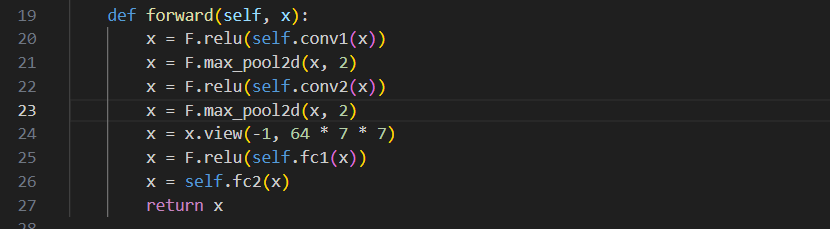

- `def forward(self, x):`
  1. x 是输入数据（图像）

- `x = F.relu(self.conv1(x))`
  1. relu是一个激活函数，ReLU函数，会把所有负值变成0，正直保持不变。
  2. self.conv1就是上面那个初始函数里定义的第一层卷积。
  3. ReLU有什么好处呢？（其实可以不用知道，只要会用就行了）

  - **避免梯度消失**：
    在传统的激活函数如 Sigmoid 或 Tanh 中，当输入值过大或过小时，梯度会变得非常小，导致梯度消失问题（即反向传播时梯度趋于零），从而使得模型难以训练。
    ReLU 在正区间内的梯度始终为 1，这样能够有效避免梯度消失问题，使得网络能够更好地训练。
  - **计算效率高**：
    ReLU 的计算非常简单，只需要判断输入是否大于零。相比于 Sigmoid 和 Tanh 函数，ReLU 的计算量更小，计算速度更快，有利于加速训练过程。
  - **稀疏激活**：
    ReLU 会将负值转换为 0，这意味着它输出的值中会有很多 0。这种特性使得神经网络在进行前向传播时，许多神经元会被“关闭”，实现了稀疏激活。
    稀疏激活有助于减少计算量，并且有助于改善模型的泛化能力。
    - 泛化能力：模型在遇到未见过的数据时，能否做出准确的预测
    - 为什么稀疏激活能改善泛化能力？
    1. 减少过拟合：数据少——想得少——不容易想到奇怪的地方去
    2. 更好的特征选择：就没几个能选的，那选出来的大概率是重要特征
    3. 降低计算成本

  - **加速收敛**：
  由于 ReLU 的梯度较大且不容易消失，它通常能够加速模型的收敛速度。与 Sigmoid 或 Tanh 相比，使用 ReLU 的模型通常会更快收敛到较优解。
  - **适应性强**：
  ReLU 能够适应不同的网络结构，尤其是在深度神经网络（DNN）和卷积神经网络（CNN）中，能够有效提升模型的训练效果。
  它可以帮助网络更好地捕捉到数据的特征，提高网络的表现。
- `x = F.max_pool2d(x, 2)`

  1. 最大池化
  2. 池化窗口为2x2
- `x = F.relu(self.conv2(x))`
  1. 第二层卷积
  2. 卷完了再过一遍ReLU
- `x = F.max_pool2d(x, 2)`
  1. 梅开二度
- `x = x.view(-1, 64 * 7 * 7)`

  用于调整张量形状，将张量 x 的形状调整为 (batch_size, 64 * 7 * 7)
  1. -1：一个特殊的值，表示 PyTorch 自动推断这一维的大小。例如，如果输入张量的批量大小（batch_size）是 32，则 -1 会被替换成 32。
  2. 64 * 7 * 7：这表示输出张量的第二维大小。64 是卷积层输出的通道数，7 * 7 是特征图的空间尺寸。
- `x = F.relu(self.fc1(x))`
  1. 在第一个全连接层里过一遍，然后过一遍ReLU
  2. 引入非线性关系，总而言之就是让它学得更好
- `x = self.fc2(x)`
  1. 为什么这里就不用ReLU一下了呢？
  - fc2 作为网络中的输出层，它的主要作用是生成模型的最终预测结果。
  - 对于输出层来说，我们往往需要原始的、不加限制的数值或概率值，而 ReLU 会将负数映射为 0。

---
### 4. 预处理数据
---
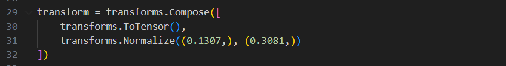

- `transform = transforms.Compose`
  1. transforms.Compose 是用来图像预处理和数据增强的一个工具，可以在里面写东西，将多个图像转换操作按顺序组合成一个组合操作，并应用于图像数据。
- `transforms.ToTensor()`
  1. 将图像数据从 PIL 图像或 NumPy 数组转换为 PyTorch 张量（Tensor）
  2. PyTorch 张量的格式是 [C, H, W]，其中 C 是通道数，H 是图像的高度，W 是图像的宽度
  3. 说人话：每个像素的值将会从原来的整数（ 0 - 255 ）变成 [0, 1] 。
  - 转化到[0,1]：
  - 可以提高训练的稳定性和效率。如果图像数值差异很大，可能导致梯度算爆，而将图像像素值归一化到 [0, 1] 的范围，能够确保数据具有统一的尺度，有助于提高训练的稳定性。
- `transforms.Normalize((0.1307,), (0.3081,))`
  1. 标准化
  2. transforms.Normalize((均值), (标准差))
  3. (0.1307,), (0.3081,)这两个数字是提前算好的。
  4. 将输入图像的像素值调整到具有均值 0 和标准差 1 的标准正态分布。
   

---
### 5. 加载MNIST数据
---
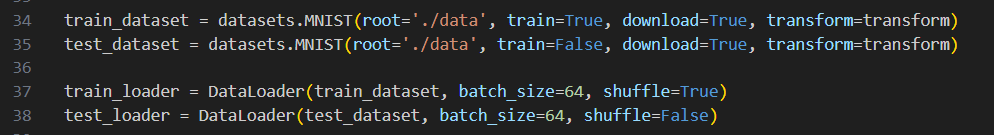
- `train_dataset = datasets.MNIST(root='./data', train=True, download=True, transform=transform)`
  1. datasets.MNIST：加载 MNIST 数据集
  2. root='./data'：数据集下载并存储在当前目录下的 data 文件夹中。如果目录不存在，PyTorch 会自动创建该目录。
  3. train=True：加载训练集。如果你将其设置为 train=False，则加载的是测试集（包含 10,000 张手写数字图像，用于评估模型）。
  4. download=True：如果 root 目录中没有找到数据集，PyTorch 会自动从互联网下载 MNIST 数据集并存储到指定的路径（即 root 参数指定的路径）。如果数据集已经存在，则不会再次下载。
  5. transform=transform：对加载的图像进行预处理。
- `test_dataset = datasets.MNIST(root='./data', train=False, download=True, transform=transform)`
  1. train=True：加载测试集。
- `train_loader = DataLoader(train_dataset, batch_size=64, shuffle=True)`
  1. DataLoader：批量加载数据，在训练过程中按批次加载数据，自动管理数据迭代的过程。
  2. train_dataset：是之前创建的 MNIST 训练集，包含所有训练样本的数据集，可以直接从中提取图像和标签。
  3. batch_size=64：每个训练批次包含 64 张图像。
  4. shuffle=True：每次从 train_dataset 中加载数据时，都会将数据打乱（随机化顺序）。
- `test_loader = DataLoader(test_dataset, batch_size=64, shuffle=False)`
  1. 加载测试集时，不打乱顺序。
  2. 有助于我们在多次评估过程中对测试结果进行稳定的比较。

---
### 6. 训练CNN
---
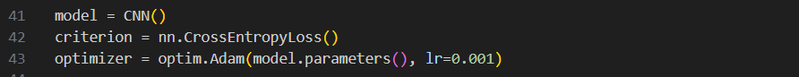

- model = CNN()
  1. 创建一个CNN实例
- criterion = nn.CrossEntropyLoss()
  1. 定义损失函数
  2. 说人话：
  - 将模型输出的原始分数转换为概率分布，输出的每个元素表示该类别的概率。
  - 评估模型输出的概率分布与真实标签之间的差距，差异越小，损失越小。
- `optimizer = optim.Adam(model.parameters(), lr=0.001)`
  1. Adam是基于梯度下降的优化算法
  2. model.parameters()返回一个迭代器，它包含了模型中所有可以训练的参数（如卷积层的权重、全连接层的权重和偏置等）。这些参数会被传递给优化器，用于计算梯度并更新。
  - 说人话：传数据用的
  3. lr=0.001：lr 是 学习率，表示优化器在每次更新参数时的步长。学习率越大，参数更新步伐越大；学习率过小可能导致收敛速度过慢，过大可能导致跳过最优解。
  - 步长就是更新参数时候的幅度，有个数学公式。

---
### 7. 循环训练
---
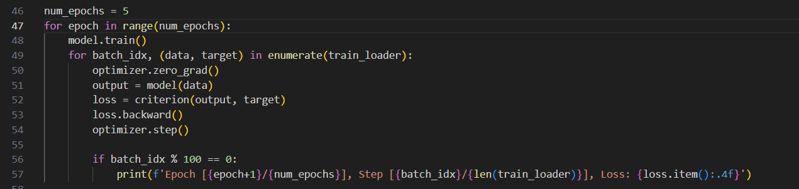

- `num_epochs = 5`
  1. 一共循环5次
- `model.train()`
  1. 这是定义在nn.Module里的，能直接用
- `for batch_idx, (data, target) in enumerate(train_loader):`
  1. batch_idx：表示当前批次的索引。
  2. data：表示输入数据,一个形状为 [batch_size, 1, 28, 28] 的张量（灰度图像，大小为 28x28）。
  3. target：表示输入数据对应的标签。
  4. enumerate (想要遍历的对象, 计数的起始值（如果不写就默认是0）)：
  5. train_loader 是一个数据加载器，用于加载训练数据集并按批次（batch）将数据分成小块。
- `optimizer.zero_grad()`
  1. 清除优化器梯度
  2. 将所有模型参数的 .grad 属性（梯度）清零
  3. 在每次反向传播之前调用，以确保每个批次的梯度计算不受上一个批次梯度的影响。
- `output = model(data)`
  1. data 来自于数据加载器 train_loader，它是一个形状为 (batch_size, channels, height, width) 的张量.
- `loss = criterion(output, target)`
  1. 接受经过CNN处理的data——output，和真实标签target对比，算出“损失”。
- `loss.backward()`
  1. backward是自带的一个函数。
  2. 反向传播该损失，将误差从输出层传递回输入层，并计算每个模型参数（例如卷积核、权重、偏置等）对于损失的梯度。
  3. 这些梯度会被存储在每个参数张量的 .grad 属性中。
- `optimizer.step()`
  1. step是一种优化器的方法，用.grad 属性中的梯度来更新模型的参数
- `if batch_idx % 100 == 0:`
  1. 每 100 个 batch 进行一次操作

---
### 8. 测试模型
---
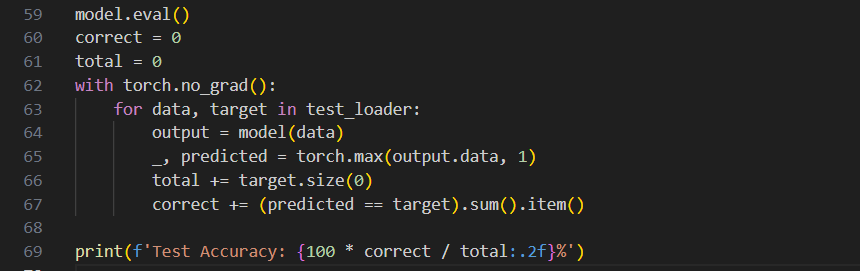
- `with torch.no_grad():`
  1. 关闭梯度运算，避免占用资源
- `_, predicted = torch.max(output.data, 1)`
  1. 找到 output.data 中每行最大值的索引（即模型预测的类别）。
  2. 忽略最大值本身，仅保留索引（predicted 就是最终的预测结果）。