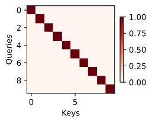

# 注意力机制

## 生物学中的注意力提示

注意力是如何应用于视觉世界中的呢？
这要从当今十分普及的*双组件*（two-component）的框架开始讲起：
这个框架的出现可以追溯到19世纪90年代的威廉·詹姆斯，
他被认为是“美国心理学之父” 。
在这个框架中，受试者基于*非自主性提示*和*自主性提示*
有选择地引导注意力的焦点。

非自主性提示是基于环境中物体的突出性和易见性。
想象一下，假如我们面前有五个物品：
一份报纸、一篇研究论文、一杯咖啡、一本笔记本和一本书，
就像下图中。
所有纸制品都是黑白印刷的，但咖啡杯是红色的。
换句话说，这个咖啡杯在这种视觉环境中是突出和显眼的，
不由自主地引起人们的注意。
所以我们会把视力最敏锐的地方放到咖啡上，
如图所示。

喝咖啡后，我们会变得兴奋并想读书，
所以转过头，重新聚焦眼睛，然后看看书，
就像图中描述那样。
与前图中由于突出性导致的选择不同，
此时选择书是受到了认知和意识的控制，
因此注意力在基于自主性提示去辅助选择时将更为谨慎。
受试者的主观意愿推动，选择的力量也就更强大。

## 查询、键和值

自主性的与非自主性的注意力提示解释了人类的注意力的方式，
下面来看看如何通过这两种注意力提示，
用神经网络来设计注意力机制的框架，

首先，考虑一个相对简单的状况，
即只使用非自主性提示。
要想将选择偏向于感官输入，
则可以简单地使用参数化的全连接层，
甚至是非参数化的最大汇聚层或平均汇聚层。

因此，“是否包含自主性提示”将注意力机制与全连接层或汇聚层区别开来。
在注意力机制的背景下，自主性提示被称为*查询*（query）。
给定任何查询，注意力机制通过*注意力汇聚*（attention pooling）
将选择引导至*感官输入*（sensory inputs，例如中间特征表示）。
在注意力机制中，这些感官输入被称为*值*（value）。
更通俗的解释，每个值都与一个*键*（key）配对，
这可以想象为感官输入的非自主提示。
如图所示，可以通过设计注意力汇聚的方式，
便于给定的查询（自主性提示）与键（非自主性提示）进行匹配，
这将引导得出最匹配的值（感官输入）。

鉴于上面所提框架在图中的主导地位，
因此这个框架下的模型将成为本章的中心。
然而，注意力机制的设计有许多替代方案。
例如可以设计一个不可微的注意力模型，
该模型可以使用强化学习方法进行训练。

## 注意力的可视化

为了可视化注意力权重，需要定义一个`show_heatmaps`函数。
其输入`matrices`的形状是
（要显示的行数，要显示的列数，查询的数目，键的数目）。

下面使用一个简单的例子进行演示。
在本例子中，仅当查询和键相同时，注意力权重为1，否则为0。

# 注意力汇聚：Nadaraya-Watson 核回归

## 平均汇聚

先使用最简单的估计器来解决回归问题。
基于平均汇聚来计算所有训练样本输出值的平均值：

$$f(x) = \frac{1}{n}\sum_{i=1}^n y_i,$$

## [**非参数注意力汇聚**]

显然，平均汇聚忽略了输入 $x_i$ 。
于是Nadaraya和
Watson提出了一个更好的想法，
根据输入的位置对输出 $y_i$ 进行加权：

$$f(x) = \sum_{i=1}^n \frac{K(x - x_i)}{\sum_{j=1}^n K(x - x_j)} y_i,$$

其中 $K$ 是*核*（kernel）。
该公式所描述的估计器被称为
*Nadaraya-Watson核回归*。
这里不会深入讨论核函数的细节，
但受此启发，
我们可以从注意力机制框架的角度
重写一个更加通用的*注意力汇聚*（attention pooling）公式：

$$f(x) = \sum_{i=1}^n \alpha(x, x_i) y_i,$$

其中 $x$ 是查询， $(x_i, y_i)$ 是键值对。
比较这两个注意力汇聚公式，
注意力汇聚是 $y_i$ 的加权平均。
将查询 $x$ 和键 $x_i$ 之间的关系建模为
*注意力权重*（attention weight）$\alpha(x,x_i)$ ，
这个权重将被分配给每一个对应值 $y_i$ 。
对于任何查询，模型在所有键值对注意力权重都是一个有效的概率分布：
它们是非负的，并且总和为1。

为了更好地理解注意力汇聚，
下面考虑一个*高斯核*（Gaussian kernel），其定义为：

$$K(u) = \frac{1}{\sqrt{2\pi}} \exp(-\frac{u^2}{2}).$$

将高斯核代入可以得到：

$$\begin{aligned} f(x) &=\sum_{i=1}^n \alpha(x, x_i) y_i\\ &= \sum_{i=1}^n \frac{\exp\left(-\frac{1}{2}(x - x_i)^2\right)}{\sum_{j=1}^n \exp\left(-\frac{1}{2}(x - x_j)^2\right)} y_i \\ &= \sum_{i=1}^n \mathrm{softmax}\left(-\frac{1}{2}(x - x_i)^2\right) y_i. \end{aligned}$$

在这个公式中，
如果一个键 $x_i$ 越是接近给定的查询 $x$ ，
那么分配给这个键对应值 $y_i$ 的注意力权重就会越大，
也就“获得了更多的注意力”。

值得注意的是，Nadaraya-Watson核回归是一个非参数模型。
*非参数的注意力汇聚*（nonparametric attention pooling）模型。

## [**带参数注意力汇聚**]

非参数的Nadaraya-Watson核回归具有*一致性*（consistency）的优点：
如果有足够的数据，此模型会收敛到最优结果。
尽管如此，我们还是可以轻松地将可学习的参数集成到注意力汇聚中。

在下面的查询 $x$ 和键 $x_i$ 之间的距离乘以可学习参数 $w$ ：

$$\begin{aligned}f(x) &= \sum_{i=1}^n \alpha(x, x_i) y_i \\ &= \sum_{i=1}^n \frac{\exp\left(-\frac{1}{2}((x - x_i)w)^2\right)}{\sum_{j=1}^n \exp\left(-\frac{1}{2}((x - x_j)w)^2\right)} y_i \\ &= \sum_{i=1}^n \mathrm{softmax}\left(-\frac{1}{2}((x - x_i)w)^2\right) y_i.\end{aligned}$$

### 批量矩阵乘法

为了更有效地计算小批量数据的注意力，
我们可以利用深度学习开发框架中提供的批量矩阵乘法。

假设第一个小批量数据包含 $n$ 个矩阵 $\mathbf{X}_1,\ldots, \mathbf{X}_n$ ，
形状为 $a\times b$ ，
第二个小批量包含 $n$ 个矩阵 $\mathbf{Y}_1, \ldots, \mathbf{Y}_n$ ，
形状为 $b\times c$ 。
它们的批量矩阵乘法得到 $n$ 个矩阵
 $\mathbf{X}_1\mathbf{Y}_1, \ldots, \mathbf{X}_n\mathbf{Y}_n$，
形状为 $a\times c$ 。
因此，[**假定两个张量的形状分别是 $(n,a,b)$ 和 $(n,b,c)$ ，
它们的批量矩阵乘法输出的形状为 $(n,a,c)$ **]。

# 注意力评分函数

使用高斯核来对查询和键之间的关系建模。
上面公式中的高斯核指数部分可以视为*注意力评分函数*（attention scoring function），
简称*评分函数*（scoring function），
然后把这个函数的输出结果输入到softmax函数中进行运算。
通过上述步骤，将得到与键对应的值的概率分布（即注意力权重）。
最后，注意力汇聚的输出就是基于这些注意力权重的值的加权和。

从宏观来看，上述算法可以用来实现
注意力机制框架。
下图说明了
如何将注意力汇聚的输出计算成为值的加权和，
其中 $a$ 表示注意力评分函数。
由于注意力权重是概率分布，
因此加权和其本质上是加权平均值。

用数学语言描述，假设有一个查询
$\mathbf{q} \in \mathbb{R}^q$ 和
$m$ 个“键－值”对
$(\mathbf{k}_1, \mathbf{v}_1), \ldots, (\mathbf{k}_m, \mathbf{v}_m)$，
其中 $\mathbf{k}_i \in \mathbb{R}^k$ , $\mathbf{v}_i \in \mathbb{R}^v$ 。 注意力汇聚函数 $f$ 就被表示成值的加权和：

$$
f(\mathbf{q}, (\mathbf{k}_1, \mathbf{v}_1), \ldots, (\mathbf{k}_m, \mathbf{v}_m)) = \sum_{i=1}^m \alpha(\mathbf{q}, \mathbf{k}_i) \mathbf{v}_i
$$
$$
\text{where the output lies in } \mathbb{R}^v
$$

其中查询 $\mathbf{q}$ 和键 $\mathbf{k}_i$ 的注意力权重（标量）
是通过注意力评分函数 $a$ 将两个向量映射成标量，
再经过softmax运算得到的：

$$
\alpha(\mathbf{q}, \mathbf{k}_i) = \mathrm{softmax}(a(\mathbf{q}, \mathbf{k}_i)) = \frac{\exp(a(\mathbf{q}, \mathbf{k}_i))}{\sum_{j=1}^m \exp(a(\mathbf{q}, \mathbf{k}_j))}
$$
$$
\text{where } \alpha(\mathbf{q}, \mathbf{k}_i) \in \mathbb{R}
$$

 
正如上图所示，选择不同的注意力评分函数 $a$ 会导致不同的注意力汇聚操作。
这里将介绍两个流行的评分函数，稍后将用他们来实现更复杂的注意力机制。

## [**掩蔽softmax操作**]

正如上面提到的，softmax操作用于输出一个概率分布作为注意力权重。
在某些情况下，并非所有的值都应该被纳入到注意力汇聚中。
例如，为了高效处理小批量数据集，
某些文本序列被填充了没有意义的特殊词元。
为了仅将有意义的词元作为值来获取注意力汇聚，
可以指定一个有效序列长度（即词元的个数），
以便在计算softmax时过滤掉超出指定范围的位置。
下面的`masked_softmax`函数
实现了这样的*掩蔽softmax操作*（masked softmax operation），
其中任何超出有效长度的位置都被掩蔽并置为0。

为了[**演示此函数是如何工作**]的，
考虑由 $2 \times 2 \times 4$ 张量表示的样本，
有效长度为 $[2,3]$
可以理解为 $[[2,2],[3,3]]$
经过掩蔽softmax操作，超出有效长度的值都被掩蔽为0。

掩蔽后张量：

    [[[0.488994  , 0.511006  , 0.        , 0.        ],
    [0.43654838, 0.56345165, 0.        , 0.        ]],

    [[0.28817102, 0.3519408 , 0.3598882 , 0.        ],
    [0.29034293, 0.25239873, 0.45725834, 0.        ]]]

同样，也可以使用二维张量，为矩阵样本中的每一行指定有效长度。

若有效长度为 $[[1,3],[2,4]]$ , 那么掩蔽后张量：

    [[[1.        , 0.        , 0.        , 0.        ],
    [0.35848376, 0.36588794, 0.2756283 , 0.        ]],

    [[0.54370314, 0.45629686, 0.        , 0.        ],
    [0.19598779, 0.25580424, 0.19916737, 0.34904057]]]

## [**加性注意力**]

一般来说，当查询和键是不同长度的矢量时，可以使用加性注意力作为评分函数。
给定查询 $\mathbf{q} \in \mathbb{R}^q$ 和
键 $\mathbf{k} \in \mathbb{R}^k$ ，
*加性注意力*（additive attention）的评分函数为

$$
a(\mathbf{q}, \mathbf{k}) = \mathbf{w}_v^\top \text{tanh}(\mathbf{W}_q \mathbf{q} + \mathbf{W}_k \mathbf{k})  \text{where } a(\mathbf{q}, \mathbf{k}) \in \mathbb{R}
$$

其中可学习的参数是 $\mathbf W_q\in\mathbb R^{h\times q}$ 、
 $\mathbf W_k\in\mathbb R^{h\times k}$ 和
$\mathbf w_v\in\mathbb R^{h}$ 。
如公式所示，
将查询和键连结起来后输入到一个多层感知机（MLP）中，
感知机包含一个隐藏层，其隐藏单元数是一个超参数 $h$ 。
通过使用 $\tanh$ 作为激活函数。

### 参数维度设置

在NLP(Natural Language Processing)中，
查询数小于等于第 $i$ 个词元序列长度，且大于0，
而键 $k_i$ 和值 $v_i$ 数量通常就是第 $i$ 个词元序列长度或者就是步数。

假设我们有一个序列 ["I", "love", "deep", "learning"]，
你可能会只对词 "love" 提出查询。
此时，查询的长度为 1，而键的长度是 4（因为整个句子有 4 个词）。

在这种情况下，
查询 "love" 会与整个句子中的所有其他词（"I", "love", "deep", "learning"）进行比较，
得到它们之间的相似度（注意力分数），
然后计算加权和。

**query**: (batch_size, num_q, feature_q)

**key**: (batch_size, num_k&v, feature_k)

**value**: (batch_size, num_k&v, feature_v)
(**注意!**查询、键和值各自的特征维度可以保持不同，此外，由于键值对的设置，键的数目和值的数目是一致的)

$W_q$: 一个线性层，输入维度是feature_q，输出维度是num_hidden,作用是将query的特征维度feature_q线性变换为num_hidden。

（此处的num_hidden代表的是query和key加和所使用的维度，由于最终注意力分数为标量，所以num_hidden是一个超参数，就像是被隐藏在这过程中）

剩下的 $W_k$ 与 $w_v$ 同 $W_q$ 有异曲同工之妙。

$W_k$: 一个线性层，输入维度是feature_k，输出维度是num_hidden

$w_v$: 一个线性层，输入维度是num_hidden，输出维度是1 (该层与value并无直接联系，故小写w)

随后可以计算 $a(\mathbf q, \mathbf k) = \mathbf w_v^\top \text{tanh}(\mathbf W_q\mathbf q + \mathbf W_k \mathbf k) \text{, where }a(\mathbf q, \mathbf k)\in \mathbb{R},$ 得到注意力分数，此时注意力分数张量是(batch_size, num_q, num_k&v, 1), 最后一个维度可以去除，即张量为(batch_size, num_q, num_k&v)

### 对注意力分数进行masked_softmax

**valid_lens**可以是一个 $1 \times$ batch_size的向量，
用于掩蔽掉一些注意力分数。

掩蔽之后对于各个注意力分数做softmax,使它们变成概率。

### 计算注意力汇聚函数

$$
f(\mathbf{q}, (\mathbf{k}_1, \mathbf{v}_1), \ldots, (\mathbf{k}_m, \mathbf{v}_m)) = \sum_{i=1}^m \alpha(\mathbf{q}, \mathbf{k}_i) \mathbf{v}_i \quad \text{where} \quad \mathbf{v}_i \in \mathbb{R}^v
$$

对于每一个批次，做value的加权求和，其中可以对某些注意力权重，也就是 $\alpha(\mathbf{q}, \mathbf{k}_i)$ 做暂退法dropout（把一些注意力权重设置成0）。

dropout是一种正则化技术，该技术的主要作用是防止神经网络的过拟合。

为了保证 Dropout **不会改变整体输出的期望**，我们在训练时除以 $p$ 进行缩放： $$\tilde{x} = \frac{x \cdot \mathbf{m}}{p}$$
其中：

  $\mathbf{m}$ 是一个随机变量，满足：
  $$\mathbf{m} =  \begin{cases}  1, & \text{概率 }  \\  0, & \text{概率 } 1 - p  \end{cases}$$

这样，我们计算缩放后的期望：

$$\mathbb{E}[\tilde{x}] = \mathbb{E} \left[ \frac{x \cdot \mathbf{m}}{p} \right]
$$

因为 **期望可以分配到乘法内**，并且 $\mathbb{E}[\mathbf{m}] = p$ ，所以：

$$
\mathbb{E}[\tilde{x}] = \frac{x}{p} \cdot \mathbb{E}[\mathbf{m}] = \frac{x}{p} \cdot p = x
$$

这就证明了，即使我们随机丢弃了部分神经元，整体的期望值仍然保持不变**。

### 进行批量矩阵乘法

目前attention_weights张量大小是(batch_size, num_q, num_k&v),
而values的形状是(batch_size, num_k&v, feature_v)。

批量矩阵乘法(bmm)之后我们得到结果张量的形状是(batch_size, num_q, feature_v)。

### 例

queries: Normal(0, 1, (2, 1, 20)) （(0，1）正态分布的张量)
query_size or feature_q=20

keys: Ones((2, 10, 2)) (由1填满的张量，代表了keys全部相同)
key_size or feature_k = 2

values: Arange(40, dtype=torch.float32).reshape(2, 10, 4)
（values的两个批次都是从0到40的张量
valid_lens: tensor([2, 6])

在计算过程中的超参数：
num_hiddens=8, dropout=0.1

计算得出结果是一个 $2 \times 1 \times 4$ 的张量：

    [[[ 2.0000,  3.0000,  4.0000,  5.0000]],

    [[10.0000, 11.0000, 12.0000, 13.0000]]]

queries & keys 热力图：

尽管加性注意力包含了可学习的参数，但由于本例子中每个键都是相同的，
所以[**注意力权重**]是均匀的，由指定的有效长度决定。

## [**缩放点积注意力**]

使用点积可以得到计算效率更高的评分函数，
但是点积操作要求查询和键具有相同的长度 $d$ 。
假设查询和键的所有元素都是独立的随机变量，
并且都满足零均值和单位方差，
那么两个向量的点积的均值为 $0$ ，方差为 $d$ 。
为确保无论向量长度如何，
点积的方差在不考虑向量长度的情况下仍然是$1$，
我们再将点积除以 $\sqrt{d}$ ，
则*缩放点积注意力*（scaled dot-product attention）评分函数为：

$$a(\mathbf q, \mathbf k) = \mathbf{q}^\top \mathbf{k}  /\sqrt{d}.$$

在实践中，我们通常从小批量的角度来考虑提高效率，
例如基于 $n$ 个查询和 $m$ 个键－值对计算注意力，
其中查询和键的长度为 $d$ ，值的长度为 $v$ 。
查询 $\mathbf Q\in\mathbb R^{n\times d}$ 、
键 $\mathbf K\in\mathbb R^{m\times d}$ 和
值 $\mathbf V\in\mathbb R^{m\times v}$ 的缩放点积注意力是：

$$ \mathrm{softmax}\left(\frac{\mathbf Q \mathbf K^\top }{\sqrt{d}}\right) \mathbf V \in \mathbb{R}^{n\times v}.$$

与加性注意力演示相同，由于键包含的是相同的元素，
而这些元素无法通过任何查询进行区分，因此会获得[**均匀的注意力权重**]。

# 多头注意力

在实践中，当给定相同的查询、键和值的集合时，
我们希望模型可以基于相同的注意力机制学习到不同的行为，
然后将不同的行为作为知识组合起来，
捕获序列内各种范围的依赖关系
（例如，短距离依赖和长距离依赖关系）。
因此，允许注意力机制组合使用查询、键和值的不同
*子空间表示*（representation subspaces）可能是有益的。

为此，与其只使用单独一个注意力汇聚，
我们可以用独立学习得到的 $h$ 组不同的
*线性投影*（linear projections）来变换查询、键和值。
然后，这 $h$ 组变换后的查询、键和值将并行地送到注意力汇聚中。
最后，将这 $h$ 个注意力汇聚的输出拼接在一起，
并且通过另一个可以学习的线性投影进行变换，
以产生最终输出。
这种设计被称为*多头注意力*（multihead attention）。
对于 $h$ 个注意力汇聚输出，每一个注意力汇聚都被称作一个*头*（head）。
下图展示了使用全连接层来实现可学习的线性变换的多头注意力。

## 数学模型

在实现多头注意力之前，让我们用数学语言将这个模型形式化地描述出来。
给定查询 $\mathbf{q} \in \mathbb{R}^{d_q}$ 、
键 $\mathbf{k} \in \mathbb{R}^{d_k}$ 和
值 $\mathbf{v} \in \mathbb{R}^{d_v}$，
每个注意力头$\mathbf{h}_i$（$i = 1, \ldots, h$）的计算方法为：

$$\mathbf{h}_i = f(\mathbf W_i^{(q)}\mathbf q, \mathbf W_i^{(k)}\mathbf k,\mathbf W_i^{(v)}\mathbf v) \in \mathbb R^{p_v},$$

其中，可学习的参数包括
$\mathbf W_i^{(q)}\in\mathbb R^{p_q\times d_q}$、
$\mathbf W_i^{(k)}\in\mathbb R^{p_k\times d_k}$和
$\mathbf W_i^{(v)}\in\mathbb R^{p_v\times d_v}$，
以及代表注意力汇聚的函数 $f$ 。
$f$可以是
加性注意力和缩放点积注意力。
多头注意力的输出需要经过另一个线性转换，
它对应着 $h$ 个头连结后的结果，因此其可学习参数是
$\mathbf W_o\in\mathbb R^{p_o\times h p_v}$：

$$
\mathbf{W_o} \begin{bmatrix} 
\mathbf{h_1} \\ 
\vdots \\ 
\mathbf{h_h} 
\end{bmatrix} \in \mathbb{R}^{p_o}
$$

基于这种设计，每个头都可能会关注输入的不同部分，
可以表示比简单加权平均值更复杂的函数。

# 自注意力与位置编码

在深度学习中，经常使用卷积神经网络（CNN）或循环神经网络（RNN）对序列进行编码。
想象一下，有了注意力机制之后，我们将词元序列输入注意力池化中，
以便同一组词元同时充当查询、键和值。
具体来说，每个查询都会关注所有的键－值对并生成一个注意力输出。
由于查询、键和值来自同一组输入，因此被称为
*自注意力*（self-attention）
也被称为*内部注意力*（intra-attention）

## [**自注意力**]

给定一个由词元组成的输入序列 $\mathbf{x}_1, \ldots, \mathbf{x}_n$ ，
其中任意 $\mathbf{x}_i \in \mathbb{R}^d$（$1 \leq i \leq n$） 。
该序列的自注意力输出为一个长度相同的序列
$\mathbf{y}_1, \ldots, \mathbf{y}_n$ ，其中：

$$\mathbf{y}_i = f(\mathbf{x}_i, (\mathbf{x}_1, \mathbf{x}_1), \ldots, (\mathbf{x}_n, \mathbf{x}_n)) \in \mathbb{R}^d$$

根据注意力汇聚函数 $f$ 。
对于一个翻译模型来说，
query是目标语言的一个词元，
而keys和values是相同的，都是源语言的所有单词，
通过f函数可以计算出与query匹配度最高的翻译。

## [**位置编码**]

在处理词元序列时，循环神经网络是逐个的重复地处理词元的，
而自注意力则因为并行计算而放弃了顺序操作。
为了使用序列的顺序信息，通过在输入表示中添加
*位置编码*（positional encoding）来注入绝对的或相对的位置信息。
位置编码可以通过学习得到也可以直接固定得到。
接下来描述的是基于正弦函数和余弦函数的固定位置编码

假设输入表示 $\mathbf{X} \in \mathbb{R}^{n \times d}$
包含一个序列中$n$个词元的$d$维嵌入表示。
位置编码使用相同形状的位置嵌入矩阵
$\mathbf{P} \in \mathbb{R}^{n \times d}$ 输出 
$\mathbf{X} + \mathbf{P}$ ，
矩阵第 $i$ 行、第 $2j$ 列和 $2j+1$ 列上的元素为：

$$
\begin{aligned}
p_{i, 2j} &= \sin\left(\frac{i}{10000^{2j/d}}\right), \\
p_{i, 2j+1} &= \cos\left(\frac{i}{10000^{2j/d}}\right).
\end{aligned}
$$

### 绝对位置信息

乍一看，这种基于三角函数的设计看起来很奇怪。

要解释这个设计，首先我们要理解绝对位置信息和沿着编码维度单调降低的频率。即绝对位置信息同三角函数中随着j的增加，波的频率下降的关系。

#### 以二进制为例

| 位置索引 \( pos \) | 二进制表示 |
|-------------|---------|
| 0           | 0000    |
| 1           | 0001    |
| 2           | 0010    |
| 3           | 0011    |
| 4           | 0100    |
| 5           | 0101    |
| 6           | 0110    |
| 7           | 0111    |
| 8           | 1000    |
| 9           | 1001    |
| 10          | 1010    |
| 11          | 1011    |
| 12          | 1100    |
| 13          | 1101    |
| 14          | 1110    |
| 15          | 1111    |

现在我们再来理解基于三角函数设计的绝对位置信息

### 相对位置信息

除了捕获绝对位置信息之外，上述的位置编码还允许模型学习得到输入序列中相对位置信息。
这是因为对于任何确定的位置偏移$\delta$，位置$i + \delta$处
的位置编码可以线性投影位置$i$处的位置编码来表示。

这种投影的数学解释是，令$\omega_j = 1/10000^{2j/d}$，
对于任何确定的位置偏移$\delta$，
任何一对
$(p_{i, 2j}, p_{i, 2j+1})$ 都可以线性投影到
$(p_{i+\delta, 2j}, p_{i+\delta, 2j+1})$：

$$\begin{aligned}
&\begin{bmatrix} \cos(\delta \omega_j) & \sin(\delta \omega_j) \\  -\sin(\delta \omega_j) & \cos(\delta \omega_j) \\ \end{bmatrix}
\begin{bmatrix} p_{i, 2j} \\  p_{i, 2j+1} \\ \end{bmatrix}\\
=&\begin{bmatrix} \cos(\delta \omega_j) \sin(i \omega_j) + \sin(\delta \omega_j) \cos(i \omega_j) \\  -\sin(\delta \omega_j) \sin(i \omega_j) + \cos(\delta \omega_j) \cos(i \omega_j) \\ \end{bmatrix}\\
=&\begin{bmatrix} \sin\left((i+\delta) \omega_j\right) \\  \cos\left((i+\delta) \omega_j\right) \\ \end{bmatrix}\\
=& 
\begin{bmatrix} p_{i+\delta, 2j} \\  p_{i+\delta, 2j+1} \\ \end{bmatrix},
\end{aligned}$$

$2\times 2$ 投影矩阵不依赖于任何位置的索引 $i$ 。

# Transformer

Transformer作为编码器－解码器架构的一个实例，其整体架构在下图中展示。正如所见到的，Transformer的编码器和解码器是基于自注意力的模块叠加而成的，源（输入）序列和目标（输出）序列的*嵌入*（embedding）表示将加上*位置编码*（positional encoding），再分别输入到编码器和解码器中。

从宏观角度来看，Transformer的编码器是由多个相同的层叠加而成的，每个层都有两个子层（子层表示为$\mathrm{sublayer}$）。第一个子层是*多头自注意力*（multi-head self-attention）汇聚；第二个子层是*基于位置的前馈网络*（positionwise feed-forward network）。具体来说，在计算编码器的自注意力时，查询、键和值都来自前一个编码器层的输出。受残差网络的启发，每个子层都采用了*残差连接*（residual connection）。在Transformer中，对于序列中任何位置的任何输入$\mathbf{x} \in \mathbb{R}^d$，都要求满足$\mathrm{sublayer}(\mathbf{x}) \in \mathbb{R}^d$，以便残差连接满足$\mathbf{x} + \mathrm{sublayer}(\mathbf{x}) \in \mathbb{R}^d$。在残差连接的加法计算之后，紧接着应用*层规范化*（layer normalization）。因此，输入序列对应的每个位置，Transformer编码器都将输出一个$d$维表示向量。

Transformer解码器也是由多个相同的层叠加而成的，并且层中使用了残差连接和层规范化。除了编码器中描述的两个子层之外，解码器还在这两个子层之间插入了第三个子层，称为*编码器－解码器注意力*（encoder-decoder attention）层。在编码器－解码器注意力中，查询来自前一个解码器层的输出，而键和值来自整个编码器的输出。在解码器自注意力中，查询、键和值都来自上一个解码器层的输出。但是，解码器中的每个位置只能考虑该位置之前的所有位置。这种*掩蔽*（masked）注意力保留了*自回归*（auto-regressive）属性，确保预测仅依赖于已生成的输出词元。

## [**基于位置的前馈网络**]

基于位置的前馈网络对序列中的所有位置的输入进行变换时使用的是同一个多层感知机（MLP），和其他位置的输入没有任何关系，这就是称前馈网络是*基于位置的*（positionwise）的原因。在下面的实现中，输入`X`的形状（批量大小，时间步数或序列长度，隐单元数或特征维度）将被一个两层的感知机转换成形状为（批量大小，时间步数，`ffn_num_outputs`）的输出张量。

第一层全连接：该层将输入的每个位置的向量从 **特征维度** 映射到 **隐藏层维度**，经过一个线性变换。

激活函数：然后应用一个非线性激活函数，ReLU，来增加模型的非线性能力。

ReLU (Rectified Linear Unit) 的公式为：

$$
\text{ReLU}(x) = \max(0, x)
$$

这意味着如果输入 $ x $ 为负数，则输出为 0；如果输入 $ x $ 为正数，则输出为 $ x $ 本身。

第二层全连接：接着通过第二个全连接层将隐藏层的维度从 **隐藏层维度** 映射到 `ffn_num_outputs`（通常是与输入的特征维度相同）。

## [**残差连接和层规范化**]

现在让我们关注 *加法和规范化*（add&norm）组件。这是由残差连接和紧随其后的层规范化组成的。两者都是构建有效的深度架构的关键。

层规范化的作用是将一个特征维度进行规范化：
计算平均值，计算方差，最终通过线性变换使得它们符合正态分布。

给定张量 \( X \)：

$$
X = \begin{bmatrix} 1 & 2 \\ 2 & 3 \end{bmatrix}
$$

### **残差连接** 的操作

核心思想是：每一层的输出不仅仅依赖于当前层的计算结果，还与输入通过直接的加法操作相结合，这样可以使网络更容易训练。

具体的操作是：对输出张量Y做dropout正则化，然后与输入张量X相加，这也要求了输出张量和输入张量的形状相同。

残差连接有助于缓解 梯度消失 和 梯度爆炸 问题，并促进更深层次的网络训练。具体来说：

1. 在传统的深层网络中，随着网络的深度增加，梯度可能会变得非常小或非常大，导致训练变得困难。而残差连接通过 直接传递梯度（通过加法）来缓解这个问题。
2. 由于直接传递了 输入的信息（即 X），即使某一层的计算表现不佳，网络也能通过残差连接保留一些有效的信息，有助于更好的学习。

### **层规范化** 的操作

`LayerNorm(2)` 表示对于每一行的 2 个特征维度（即每个样本的特征），进行标准化处理。

标准化的公式为：

$$
X_{\text{normalized}} = \frac{X - \mu}{\sigma}
$$

其中：
- $\mu$ 是该行的均值，
- $\sigma$ 是该行的标准差。

我们分别对每一行进行计算。

---

### **第一行：[1, 2]** 的计算：

1. **均值** ( $\mu_1$ )：

$$
\mu_1 = \frac{1 + 2}{2} = 1.5
$$

2. **标准差** ( $\sigma_1$ )：

$$
\sigma_1 = \sqrt{\frac{(1 - 1.5)^2 + (2 - 1.5)^2}{2}} = \sqrt{\frac{0.25 + 0.25}{2}} = \sqrt{0.25} = 0.5
$$

3. **标准化**：

$$
X_{\text{normalized}} = \frac{[1, 2] - 1.5}{0.5} = \left[\frac{1 - 1.5}{0.5}, \frac{2 - 1.5}{0.5}\right] = [-1, 1]
$$

---

### **第二行：[2, 3]** 的计算：

1. **均值** ( $\mu_2$ )：

$$
\mu_2 = \frac{2 + 3}{2} = 2.5
$$

2. **标准差** ( $\sigma_2$ )：

$$
\sigma_2 = \sqrt{\frac{(2 - 2.5)^2 + (3 - 2.5)^2}{2}} = \sqrt{\frac{0.25 + 0.25}{2}} = \sqrt{0.25} = 0.5
$$

3. **标准化**：

$$
X_{\text{normalized}} = \frac{[2, 3] - 2.5}{0.5} = \left[\frac{2 - 2.5}{0.5}, \frac{3 - 2.5}{0.5}\right] = [-1, 1]
$$

---

### **最终的标准化结果**

标准化后的矩阵 $X_{\text{normalized}}$ 为：

$$
X_{\text{normalized}} = \begin{bmatrix}
-1 & 1 \\
-1 & 1 \\
\end{bmatrix}
$$

### AddNorm

将残差连接和层规范化结合起来

$$
\text{Output} = \text{LayerNorm}(\text{Dropout}(Y) + X)
$$

## 编码器

有了组成Transformer编码器的基础组件，现在可以先[**实现编码器中的一个层**]。下面的`EncoderBlock`类包含两个子层：多头自注意力和基于位置的前馈网络，这两个子层都使用了残差连接和紧随的层规范化。

### Encoder Block

1. **Multi-head Attention**：
   
   多头注意力机制可以通过多个注意力头并行计算，然后将它们的结果拼接起来，最终通过一个线性变换得到输出。多头注意力可以表示为：

   $$\text{MultiHeadAttention}(Q, K, V) = \text{Concat}(head_1, head_2, \dots, head_h)W^O$$

   其中，$h$ 是头的数量，$Q, K, V$ 是查询、键、值矩阵，$W^O$ 是输出的线性变换矩阵。每个注意力头的计算如下：

   $$head_i = \text{Attention}(QW_i^Q, KW_i^K, VW_i^V)$$

   其中，$W_i^Q$ , $W_i^K$ , $W_i^V$ 是每个头的参数, $\text{Attention}(Q, K, V)$ 是标准的缩放点积注意力。

   缩放点积注意力公式为：

   $$\text{Attention}(Q, K, V) = \text{softmax}\left(\frac{QK^T}{\sqrt{d_k}}\right)V$$

   其中, $d_k$ 是键的维度。

2. **AddNorm 1**：
   
   对于第一个规范化操作，假设 $X$ 为输入， $\text{MultiHeadAttention}(X, X, X)$ 为通过多头注意力计算得到的输出，规范化步骤为：

   $$ Y_1 = \text{AddNorm}(X, \text{MultiHeadAttention}(X, X, X)) $$

   这里，`AddNorm` 表示加法和归一化操作。

3. **Feed-Forward Network**：
    
   在前馈神经网络中，我们先对输入 $Y_1$ 应用一个全连接层，然后进行非线性激活，最后再经过一个全连接层：

   $$ \text{FFN}(Y_1) = \text{ReLU}(Y_1W_1 + b_1)W_2 + b_2 $$

   其中，$W_1$ , $W_2$ 是权重矩阵，$b_1$ , $b_2$ 是偏置,  $\text{ReLU}$ 是激活函数。

4. **AddNorm 2**：
   
   对于第二个规范化操作，最终输出是：

   $$Y_2 = \text{AddNorm}(Y_1, \text{FFN}(Y_1))$$

5. **最终输出**：
   
   所以，Encoder Block的输出可以表示为：

   $$\text{EncoderBlock}(X) = \text{AddNorm}(\text{AddNorm}(X, \text{MultiHeadAttention}(X, X, X)), \text{FFN}(\text{AddNorm}(X, \text{MultiHeadAttention}(X, X, X))))$$

### Transformer 编码器的组成

编码器首先将输入的词元转化为嵌入表示，然后通过 **位置编码** 加入词元的位置信息。由于Transformer没有卷积或递归结构，位置编码非常关键，它为每个词元添加了关于词元相对位置的信息。

$$
X = \text{Embedding}(X) + \text{PositionalEncoding}(X)
$$

然后X会通过多个 Encoder 块，
每个 Encoder 块都会接收上一层的输出作为输入。

经过所有的 Encoder 块后，最后一个 Encoder 块的输出就是 编码器的最终输出，这些输出将被传递给解码器。

## 解码器

[**Transformer解码器也是由多个相同的层组成**]。在`DecoderBlock`类中实现的每个层包含了三个子层：解码器自注意力、“编码器-解码器”注意力和基于位置的前馈网络。这些子层也都被残差连接和紧随的层规范化围绕。

在掩蔽多头解码器自注意力层（第一个子层）中，查询、键和值都来自上一个解码器层的输出。关于*序列到序列模型*（sequence-to-sequence model），在训练阶段，其输出序列的所有位置（时间步）的词元都是已知的；然而，在预测阶段，其输出序列的词元是逐个生成的。因此，在任何解码器时间步中，只有生成的词元才能用于解码器的自注意力计算中。为了在解码器中保留自回归的属性，其掩蔽自注意力设定了参数`dec_valid_lens`，以便任何查询都只会与解码器中所有已经生成词元的位置（即直到该查询位置为止）进行注意力计算。

`DecoderBlock` 是解码器中的第 i 个块，负责生成目标序列的输出。该块通过自注意力和编码器-解码器注意力机制来进行序列建模。

### 输入参数

- **`X`**：解码器的输入（目标序列的词元表示）。形状为 `(batch_size, num_steps, d)`，其中 `d` 是词元的维度。
- **`state`**：包含三个部分的元组：
  - `state[0]`：编码器的输出，形状为 `(batch_size, num_steps, num_hiddens)`。
  - `state[1]`：编码器的有效长度，形状为 `(batch_size,)` 或 `(batch_size, num_steps)`。
  - `state[2]`：解码器的内部状态，用于缓存解码过程中的输出表示。

### 1. 初始化 `key_values`

解码器在训练和推理阶段的行为不同。在训练时，所有的词元会在同一时间步进行处理，因此 `state[2][self.i]` 初始化为 `None`。在推理时，解码是一个个时间步逐步进行的，`state[2][self.i]` 会缓存到目前为止生成的解码器输出。

$$
key\_values = 
\begin{cases} 
X & \text{if } state[2][self.i] \text{ is None} \\
\text{concatenate}(state[2][self.i], X) & \text{otherwise}
\end{cases}
$$

**在推理的过程中** $\text{concatenate}$ 的作用是将当前解码器块（self.i）的输出 state[2][self.i] 和当前时间步的输入 X（查询） 拼接在一起。这意味着，当前解码器块将使用之前生成的解码结果和当前时刻的输入来计算当前时刻的输出。例如，如果 $state[2][self.i] = (batch_size, 1, d)$ ，那么key_values会是X和state[2][self.i]拼接变成形状(batch_size, 2, d)，依旧可以通过复制X（查询）的方式和当前时间步形状为（batch_size, 1,d）的X（查询）进行注意力分数的计算。

### 2. 生成解码器的有效长度 (`dec_valid_lens`)

在训练时，`dec_valid_lens` 是一个从 1 到 `num_steps` 的序列，用来表示每个查询的有效长度。该有效长度用于计算自注意力时的掩码（masking）。在推理时，`dec_valid_lens` 设为 `None`，因为解码是逐步进行的。

$$
dec\_valid\_lens = \text{arange}(1, num\_steps + 1) \quad \text{(训练阶段)}
$$

基于 dec_valid_lens，我们可以构造出一个掩码（mask），以防止模型在自注意力中访问到不应该访问的未来信息。具体来说，我们可以根据 dec_valid_lens 来标记哪些位置是“有效”的，哪些位置是“无效”的。

### 3. 自注意力（Self-Attention）

自注意力机制通过查询、键和值来计算每个位置的注意力权重，并加权求和得到每个位置的表示。自注意力的计算公式为：

$$
Q = X, \quad K = V = key\_values
$$

自注意力的输出 $X_2$ 通过点积计算注意力分数，进行缩放，最后通过 softmax 获取注意力权重，然后加权求和得到结果：

$$
X_2 = \text{Attention}(Q, K, V)
$$

然后，添加残差连接并进行层归一化：

$$
Y = \text{AddNorm}(X, X_2)
$$

### 4. 编码器-解码器注意力（Encoder-Decoder Attention）

编码器-解码器注意力通过将解码器的输出 `Y` 与编码器的输出 `enc_outputs` 进行交互来计算注意力。其公式为：

$$
Q = Y, \quad K = V = enc\_outputs
$$

编码器-解码器注意力的输出 $Y_2$ 同样通过点积计算注意力分数，进行缩放，最后通过 softmax 获取注意力权重，进行加权求和：

$$
Y_2 = \text{Attention}(Q, K, V)
$$

然后，添加残差连接并进行层归一化：

$$
Z = \text{AddNorm}(Y, Y_2)
$$

### 5. 前馈神经网络（FeedForward Network）

最后，通过前馈神经网络对输出 $Z$ 进行处理，得到最终的输出：

$$
\text{Output} = \text{AddNorm}(Z, \text{FFN}(Z))
$$

### 最终输出

`DecoderBlock` 的输出是经过前馈神经网络处理后的结果，以及更新后的 `state`，其中 `state[2]` 缓存了当前块解码后的输出。

## Transformer 解码器

### 输入嵌入（Input Embedding）
解码器的输入是目标序列的词元，在训练阶段，它们是已知的，而在推理阶段，它们是逐步生成的。在每个时间步，解码器会根据之前的词元生成当前时间步的输出。

词元嵌入：首先，目标序列的每个词元被转换为一个嵌入向量，嵌入向量的维度通常与编码器的输出维度（d）相同。
位置编码：然后，目标序列的嵌入向量与相应的位置编码相加，位置编码用于提供关于词元在序列中位置的信息。

### 输入进入解码器块（Entering Decoder Block）：

输入的嵌入向量（加上位置编码后的目标序列）将进入多个 解码器块（Decoder Block）。
每个解码器块的输出将作为下一个解码器块的输入，最终得到解码器的输出。

### 生成预测（Prediction Generation）：

解码器的最终输出将用于生成目标序列的下一个词元的概率分布。
在训练阶段，解码器通过当前的输出和目标序列生成下一个词元的预测。
在推理阶段，解码器逐步生成目标序列中的词元。

